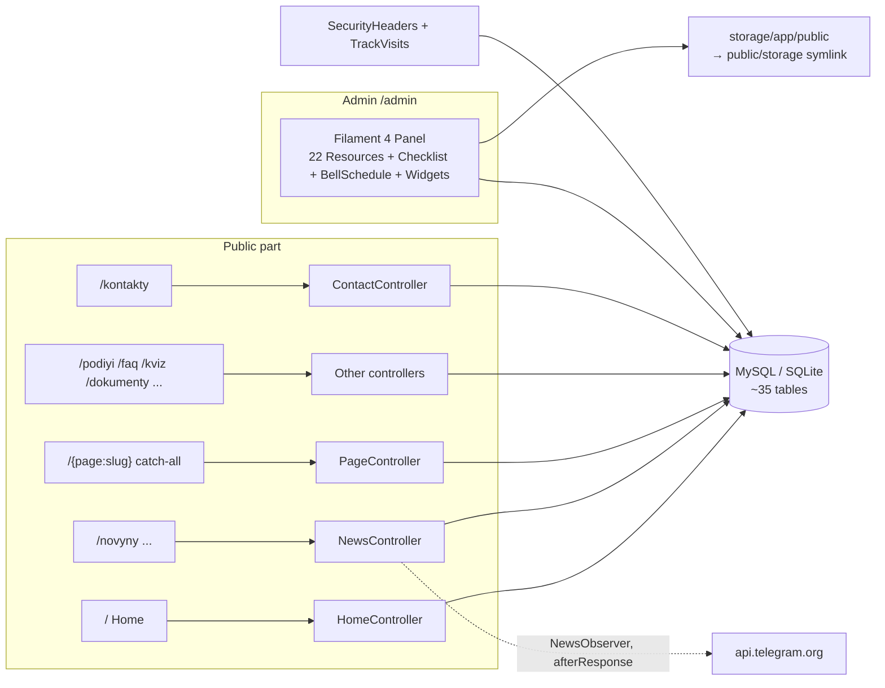

# Architecture of the OTFK site (otfk)

> The authoritative project reference. It is kept in sync with the code (rules — in [AGENTS.md](AGENTS.md) for Codex and [CLAUDE.md](CLAUDE.md) for Claude). After every completed task, either agent updates both instruction files.
> HTML version: `ARCHITECTURE.html` — a build artifact generated by `node DocsHtml/generate.mjs`; it is not edited by hand.

## TL;DR

- **What it is:** the new website of the Odesa Technical Vocational College of ONTU (replacement for the old otfk.od.ua), written from scratch as a **proof of concept**. Public part + admin panel.
- **Stack (confirmed by the code, NOT "plain PHP"):** PHP ^8.2 (CI/prod — 8.3), **Laravel 12**, **Filament 4** (the whole admin; theme `resources/css/filament/admin/theme.css`; the `public` disk address is relative — `/storage`), Blade + **Tailwind CSS v4** + **Alpine.js 3**, Vite 7. DB: SQLite in dev/tests, **MySQL in production**. Composer + npm.
- **Hosting:** shared hosting ukraine.com.ua (SSH, no Node, no queue worker) — this is the source of the key patterns: the frontend is built in CI and uploaded to the server via rsync (deploy workflow); background tasks run only via `dispatch(...)->afterResponse()`.
- **Local:** `php artisan serve --port=8002` (see `.claude/launch.json`), or `composer run dev` (it also starts queue:listen, pail and Vite; the queue is for dev only, there is no worker in production). Tests: `composer test` (SQLite `:memory:`).
- **PoC status:** seed data is fictional; a «Альфа-версія» ("Alpha version") badge is shown in the footer; the `admin`/`editor` roles and basic admin-panel protection were introduced on 06.10.2026 (see "Authorization and roles", `docs/security-audit.md`). The full list is in the [PoC-only](#poc-only-removereplace-before-production) section.

## Repository structure

| Directory / file | Contents |
|---|---|
| `app/Http/Controllers/` | Controllers of the public part (the admin does not use them) |
| `app/Http/Middleware/` | `SetPublicLocale` (global; also `X-Robots-Tag: noindex, nofollow` outside the primary domain — `App\Support\Seo`); `SecurityHeaders` (`web` group **and** the Filament panel stack); `TrackVisits` (`web` only) |
| `app/Filament/` | The whole admin: Resources (22), Pages (`ContentChecklist`, `BrokenLinks`, `BellSchedule` + settings form pages), `Support/SettingsFormPage`, Widgets |
| `app/Models/` | 28 Eloquent models (incl. `LegacyRedirect`, `NotFoundLog`) + traits `Concerns/OptimizesUploadedImages`, `Concerns/HasEnglishTranslation`, `Concerns/FlushesSitemap` (sitemap cache flush on saved/deleted); `User` — `admin`/`editor` roles and guards |
| `app/Policies/`, `app/Rules/`, `app/Casts/`, `app/Listeners/`, `app/Filament/Auth/` | `AdminOnlyPolicy` (+ `UserPolicy`, `SettingPolicy`, `MenuItemPolicy`), rule `SafeUrl`, cast `SafeHtml`, listener `LogAuthenticationEvents` (login log), `Auth/Login` (lockout log), `Auth/TwoFactorSetup`/`TwoFactorChallenge` (second factor) |
| `app/Services/` | `TelegramPoster` — outgoing posting of news to the Telegram channel |
| `app/Support/` | `LegacyRedirects` (404 handling: old-address map → 301/308/410, normalization, log), `Seo` (indexing policy from `config/otfk.php` → `seo`, canonical with the `page`/`category`/`year` parameters), `ImageOptimizer` (GD → WebP), `BannerOverlay` (inline-CSS gradients), `AdminPreview`, `LinkChecker`, `UniqueSlug`, `HtmlSanitizer` + `Sanitizer/IframeSourceSanitizer` (cleaning of editor HTML on save via `symfony/html-sanitizer`) |
| `app/Jobs/`, `app/Mail/` | `PostNewsToTelegram`; the built-in contact and request forms are removed, service e-mails are deleted |
| `app/Observers/` | `NewsObserver` — trigger of the Telegram autopost (attached via an attribute on the model!) |
| `app/Console/Commands/` | `otfk:legacy-redirects` (import of the old-address map from CSV: dry-run → `--apply`, a copy of the CSV and a report in `storage/app/private/legacy-redirects`), `otfk:legacy-map` (builds this CSV by read-only access to the DB/`public` disk: `imported-from` markers of Page/News/Specialty/Department/Staff → Ukrainian URL of the published item, `file_mirrors` done → `publicUrl()`, the CMS page of a documents section → directly `/dokumenty/{slug}`, `news/imported` photos only with a known old path (basename collisions go to conflicts, guessing only with `--guess-photos`), `imported/*` assets, PDFs `documents/*/<md5>.pdf`; `--sitemap`/`--urls`/`--scan-dir` — sources of old addresses, uncovered ones go to `<out>.unmapped.csv`; `--verify` — file/sha256 of the mirror/route; run on the hosting where the storage lives), `otfk:seo-smoke` (HTTP check of the deployed site: `--expect=indexable|closed`, robots, sitemap, canonical/og:url, 404 for an unknown path, `--check-redirects`, `--resolve=host:port:ip` before the DNS switch; retries only on network error/5xx, redirects are not followed), `otfk:backup`, `images:webp`, `otfk:import-docs`, `otfk:import-news`, `otfk:mirror-files`, `otfk:storage-export`, `otfk:storage-import`, `otfk:two-factor` (status/emergency 2FA reset), `otfk:sanitize-content` (report/cleaning of old HTML: a read pass → a unique JSON backup with translation hashes, `updated_at` and the connection name → write by an atomic conditional UPDATE (all scanned values in the WHERE, BINARY on MySQL); a conflict = skip and exit code 1; the DOM classifier "removed/normalization" takes into account the `style`/`class` values; `--connection=`, `--backup-dir=` — tests write backups to a temporary directory, not to `storage/app/private`) |
| `bootstrap/app.php` | Route registration, health `/up`, custom middleware, render-callback `NotFoundHttpException` → `LegacyRedirects::handleNotFound()` |
| `config/` | Laravel 12 stock, except `blade-icons.php` (default `<x-icon>` disabled), `livewire.php` (allow-list of extensions/MIME and 20 MB for all admin uploads), `otfk.php` (`two_factor.enforce`/issuer, `seo.indexing`/`seo.primary_host`) and the `security` channel in `logging.php` |
| `database/migrations/` | Schema **and content fixtures** (see "Migrations as content fixtures") |
| `database/seeders/` | `DatabaseSeeder` (admin), `SiteSeeder` (demo data, destructive!), `QuizSeeder` |
| `routes/web.php` | Common SEO addresses and registration of `routes/public.php` for `/` and `/en` (there are no API/webhook routes) |
| `routes/console.php` | Schedule: database backup, pruning of visits and `model:prune` of the 404 log (weekly, UTC) |
| `resources/views/` | Blade: a single layout `components/layouts/app.blade.php` + pages |
| `resources/css/app.css`, `resources/js/app.js` | Tailwind v4 theme + Alpine; all custom JS is inline in the layout |
| `public/build/` | Vite production bundle; **not included in git** — it is built locally (`npm run build`) and in CI during deploy |
| `tests/Feature/` | Feature tests; many of them fix behavioral contracts |
| `docs/posibnyk-administratora.md` | Administrator handbook for staff (UK): login, roles, rules, sections, typical tasks, incidents |
| `docs/security-audit.md`, `docs/admin-roadmap.md` | Security audit of the admin panel (06.10.2026, RU; high-severity findings fixed in the same change) and the plan for further improvements (2FA, profile, change log, backups) |
| `storage/app/public/.htaccess`, `public/.htaccess` | Prohibition of script execution in `/storage/` by two mechanisms: `RewriteRule … [F]` in `public/.htaccess` (mod_rewrite) and `Require`/`Deny` + CSP `sandbox` for HTML/SVG in the uploads directory |
| `DocsHtml/generate.mjs` | Generator of the HTML twins of this documentation |
| `.github/workflows/` | `tests.yml` (tests + frontend build) and `deploy.yml` (auto-deploy: `master` → branch `plesk-build` for Laravel Toolkit on Plesk new.otfk.od.ua, `test` → SSH to the test hosting) |
| `DEPLOY.md`, `README.md` | Deployment to ukraine.com.ua; overview of features |
| `AGENTS.md`, `CLAUDE.md` | Synchronized working rules of Codex and Claude; each agent updates both files after a task |

## Map: pages → handlers → storage

## Routes

`SetPublicLocale` applies globally: the language is determined by the first URL segment (`en`, otherwise Ukrainian by default), including the separate middleware stack of Filament. `SecurityHeaders` and `TrackVisits` are added only to the `web` group; Filament defines its own stack in `AdminPanelProvider` and does not inherit these two middleware.

### Public (`routes/web.php`)

| Method | Path | Name | Handler | What it does | PoC-only |
|---|---|---|---|---|---|
| GET | `/` | home | `HomeController@index` | Banners, tiles, statistics, events, news, videos, "On this day" | no |
| GET | `/novyny` | news.index | `NewsController@index` | News list, pagination 9, filters `?category=`, `?year=`; unknown category and page beyond pagination — 404, the `?year=` archive — `noindex, follow` | no |
| GET | `/novyny/feed.xml` | news.feed | `NewsFeedController` | RSS, last 30, `max-age=1800` | no |
| GET | `/novyny/{news:slug}` | news.show | `NewsController@show` | Article (a future one by `published_at` — 404 for guests, as in the lists); +1 view once per session without changing `updated_at` | no |
| POST | `/novyny/{slug}/vpodobayka` | news.like | `NewsController@like` | Like toggle (JSON), fingerprint = sha1(ip+UA), `throttle:30,1` | no |
| GET | `/video` | video.index | `VideoController@index` | Videos, pagination 12 (a page beyond the range — 404) | no |
| GET | `/rozklad-dzvinkiv` | bells | `BellScheduleController@index` | Bell schedule + live indicator of the current class period | no |
| GET | `/podiyi` | events | `EventController@index` | Upcoming + 6 past events | no |
| GET | `/podiyi/{event}/ics` | events.ics | `EventController@ics` | Download of .ics | no |
| GET | `/faq` | faq | `FaqController@index` | FAQ + JSON-LD | no |
| GET | `/kviz` | quiz | `QuizController@index` | Career-guidance quiz, **scoring entirely in client-side JS** | **yes** (PoC form) |
| GET | `/dokumenty`, `/dokumenty/{cat:slug}` | documents.* | `DocumentController` | Public information (document categories) | no |
| GET | `/spetsialnosti`, `/spetsialnosti/{slug}` | specialties.* | `SpecialtyController` | Specialties + programs | no |
| GET | `/struktura`, `/struktura/{slug}` | structure.* | `StructureController` | Departments/commissions + staff. In the "Циклові комісії" (Cycle commissions) group the index shows the text of the published CMS page `ciklovi-komisiyi`: paragraphs without files — above the cards; paragraphs with links to files (rating assessment of teachers) — as `FileCards` cards below them; the list of commissions from the page is not shown (it duplicates the cards). On a department page the staff cards block is the anchor `#vykladachi` (`DepartmentStaffAnchor`): links in the description to the old `/vikladaci-komisiyi-…` pages lead there on output if cards exist; these pages themselves — 301 to the commission block (`PageController`), not in the sitemap; the old-address map leads there too | no |
| GET | `/personal/{staff:slug}` | staff.show | `StaffController@show` | Personal page of a published employee, bio facts/links, colleagues | no |
| GET | `/admin-preview/{token}` | admin.preview | `AdminPreviewController@show` | Snapshot of an unsaved form for 10 minutes; only after login, guests get 404 | no |
| GET | `/administratsiya` | staff.administration | `StaffController` | Administration | no |
| GET | `/halereya`, `/halereya/{slug}` | galleries.* | `GalleryController` | Galleries (pagination 12, a page beyond the range — 404), lightbox, archive (sepia) mode | no |
| GET | `/poshuk`, `/poshuk/pidkazky` | search.* | `SearchController` | Search with a type filter and pagination 12 (`noindex, follow`, `throttle:30,1`) + JSON suggestions (`throttle:60,1`); the query — `App\Support\SearchQuery::from()` (string only, ≤100 characters, `maxlength` in the fields); on MySQL `SearchQuery::prefilter()` narrows the selection by `title` LIKE before the PHP filter | no |
| GET | `/kontakty` | contacts | `ContactController` | Contact cards, map, social networks and the localized body of the published CMS page `kontakty` (if it exists). There is no built-in submission form. The CMS page `/zvorotniy-zvyazok` with feedback links remains public via the catch-all | no |
| GET | `/sitemap.xml`, `/robots.txt` | sitemap, robots | `SitemapController` / closure | Sitemap: only the Ukrainian canonical URLs of published items (+ departments and indexable `/en` pairs, no RSS), cache `sitemap.entries` 3600 s with flush by `FlushesSitemap`; robots does not forbid crawling even on the test domain | no |
| GET | `/up` | — | Laravel health | Health check | no |
| GET | `/{page:slug}` | pages.show | `PageController@show` | **Catch-all** for CMS pages from the DB. Must be the last | no |

### Bilingualism implementation: routes, interface, content and search

- `routes/public.php` contains the common map of public GET/POST routes with the catch-all at the end. `routes/web.php` registers it first under `/en` with the `en.*` names, then without a prefix with the previous names; the Ukrainian catch-all remains last. `en` is excluded from CMS slugs; the catch-all accepts only one segment.
- `/sitemap.xml`, `/robots.txt`, `/up`, the admin and files remain shared. `SetPublicLocale` sets `en` for `/en/...` and `uk` for the other requests, regardless of the language of the previous request.
- `App\Support\LocalizedUrl::route()` builds a link by route name; `to()` changes the language of an internal public link, keeping the query and fragment; `current()` prepares the address of the same item for the language switcher with search, filter and pagination parameters. External addresses, files and service paths are not prefixed. Absolute links to the root without a slash before the query/fragment are also localized: belonging to the site is checked by scheme/host/port and base path, the parameters/anchor are kept; external origins and URLs with userinfo are not changed. Relative addresses are resolved against the current URL by browser rules (`GuzzleHttp\Psr7\UriResolver`); anchors without a path are kept. Files intercepted by the catch-all (for example `/manual.pdf`) are not localized.
- `MenuItem::href` is connected to this mechanism; the tree is cached in common form, and the address is computed for the current language. For search suggestions under `/en` the previous exclusion from statistics applies. Views and likes are common to both addresses. The POST of contacts/requests is no longer registered.
- Header (`components/layouts/app.blade.php`): the announcement is a row with an icon and text (on phones it is cut to 3 lines and expands on tap), a separate "Детальніше" ("More details") button when `announcement_url` is set, and a close control (localStorage `ann-closed`). The desktop menu (`xl+`) always stays on one line: the Alpine `navOverflow` measures the widths of the items once after `document.fonts.ready`, recalculates via `ResizeObserver` how many fit, and the rest goes into the dropdown "Ще" ("More") (`data-nav-more`; hidden with the `!hidden` class, not `x-show`, which depends on `requestAnimationFrame`). Without JS the row wraps (`flex-wrap`). Mobile row: logo + brand with `truncate`, search and a 40×40 menu button — no horizontal scrolling at 375 px. Test — `HeaderLayoutTest`.
- The frame of the header and footer is translated via `lang/uk/layout.php` and `lang/en/layout.php`, including search, accessibility labels and the JS indicator of the current class period. The static labels of public pages and components are in `lang/*/public.php` and `lang/*/feature.php`: headings/descriptions, forms, buttons, breadcrumbs, schedule, quiz, empty states and errors. Dynamic labels of the quiz/likes are passed to Alpine via `@js`; dates/numbers are inserted as translation parameters. Search categories are localized; the previous forms are removed. Emergency 500/503 pages determine the language from the path without depending on the locale middleware or the DB. The HTML `lang`, Open Graph locale and site name match the URL. English standard brand/description without a published translation are taken from the dictionary; Ukrainian settings are kept. Public text settings and partners support a separate published translation (details below).
- `menu_items.label_en` — an optional translation, editable in Filament. `MenuItem::localized_label`: the Ukrainian original for `uk`; for `en` — a non-empty `label_en`, then the dictionary of known labels `lang/en/navigation.php`, then the original. The common tree cache does not store the computed translation; the migration of the field flushes `menu.navigation`.
- The language switcher УКР/EN (`components/language-switcher.blade.php`) is in the header from `sm` up, and on phones it is in the header of the slide-out menu (a second instance with the `aria-label` `layout.language_mobile`, so as not to duplicate the navigation "Мова" ("Language")); it leads to the same item and keeps the query, and the JS adds the current fragment on activation. The language is set by the URL, without cookies or automatic redirects.
- All public Blade links, cards, breadcrumbs/JSON-LD, the quiz, RSS and ICS links, search results/suggestions use `LocalizedUrl`; pagination keeps the prefix of the current request. The emergency 500 template chooses `/en` or `/` by the request path without accessing the DB. The sitemap is common: Ukrainian addresses and indexable `/en` pairs with hreflang.
- `App\Support\LocalizedHtml::links()` localizes the href values in the HTML of pages, news, specialties and departments on output, without changing the values in the DB. It keeps the rest of the markup, images, comments and the content of script/style/textarea; it is not a sanitizer.
- `/en` is open for indexing automatically (stage 4, the user's decision of 2026-10-08: without manual review): sections — always, items — only with a full published, up-to-date translation. The Ukrainian fallback on `/en` — `noindex, follow`, without canonical and hreflang; an edit of the original closes `/en` until the translation is updated. The translations are machine-made and not proofread.
- Page/News: nullable `title_en`, `excerpt_en`, `body_en`, a separate `translation_published` (default false), a service `translation_source_hash` (SHA-256); Page also has `meta_title_en`/`meta_description_en`. The migration `2026_10_04_130000_add_english_content_to_pages_and_news.php` does not change the original items and does not fill in translations. `HasEnglishTranslation::localized()` selects the fields only on output; the original attributes, URL slugs, counters, Telegram and the admin remain common. The translation is used on pages, in parent/child links, cards, related news, the archive block of the home page, RSS and item metadata.
- Publication requires an English title and body if the original body is non-empty; section pages without a body may have only a title. Without a full published translation the item is entirely Ukrainian, with no notifications. Optional fields of a published translation remain empty; Ukrainian fields are not mixed in; Page SEO uses the English title/excerpt when there is no English meta. Changing the original does not take the translation off publication.
- The hash covers the original title/excerpt/body and the Page meta fields. It is saved when the full translation changes or its publication is enabled; changing only the original, views, likes or other service fields does not update the hash. A mismatch gives the status «Оригінал змінено» ("Original changed") in Filament. Saving a corrected translation confirms conformity with the current original; disabling publication keeps the HTML and the hash.
- PageResource/NewsResource have an "English translation" section («Англійський переклад») and a status column. The English HTML is entered via a Textarea, so that manual transfer does not normalize tables, images and markup via the RichEditor. The selection «Батьківський розділ» ("Parent section") and the filter «Розділ» ("Section") in PageResource label the pages with the name and the path of sections in brackets (`Page::adminOptionLabel()`: "IT (Студенту › Цифрові видання у галузях)" — identical names are distinguishable; the name comes first, because Choices.js filters the server results again with fuzzy search and loses matches at the end of a long string), and do not offer the page itself or its descendants (`selfAndDescendantIds()`, protection against a cycle). The main text (body of Page/News, description of Specialty/Department) — `App\Filament\Forms\Components\HtmlRichEditor`: the Filament 4 RichEditor (TipTap: H2–H4, alignment, lists, tables with cell merging, collapsible blocks `
`, images with sizes, attachments, PDF/video) with a «Візуально / HTML» ("Visual / HTML") switcher in the field hint. The button «PDF / відео» ("PDF / video") is the plugin `App\Filament\Forms\Components\RichEditor\EmbedPlugin`: a modal window (a link or upload of a PDF to `storage/app/public/documents/vbudovani`, a title); the address is normalized by `App\Support\EmbedSource` (youtu.be/watch/shorts → `youtube.com/embed/ID?start=`, Drive/Docs → `/preview`, a map — only the embed address, own site → a relative path; the result is checked by `IframeSourceSanitizer::allowed()`), and an `<iframe>` with the import attributes is inserted (`class="w-full" style="min-height:24rem;border:0" loading="lazy"`, for video also allow/allowfullscreen/referrerpolicy). The TipTap node `embed` is a pair: `EmbedExtension` (PHP) and `public/js/admin/rich-editor-embed.js` (a static ES module, no build; it takes TipTap from `window.FilamentRichEditor.tiptap`, shows a card in the editor without loading the iframe) with a common list of attributes; existing iframes open in the visual mode without loss (the `
` wrapper around them disappears — FileCards handles both kinds). On the site a PDF iframe → a file card (FileCards), a video — a player. Test `EditorEmbedTest`. The field state is the HTML string as in the DB (`HtmlStateCast` instead of `RichEditorStateCast`, which normalizes the HTML already on load): an item can be opened and saved without edits without loss, the HTML mode writes the string unchanged, and only the TipTap document is converted into HTML after the user's own edit in the visual mode (`documentToHtml()` + `cleanEditorHtml()` without the TipTap service markup; the import markers are kept). The edit is detected by comparing the document with the snapshot taken after the text is loaded (any method: keyboard, toolbar, dragging, image resizing); a document matching the snapshot (TipTap normalization) is rolled back by the client to the original string. Images are resized with the mouse (`resizableImages()`) or with the buttons of the floating panel «Мале/Середнє/Велике/Уся ширина» ("Small/Medium/Large/Full width") (⅓/½/¾ of the site column); the text area in the editor has the width of the site column; photos without a size are shown compactly with a note; on the site `.prose-site img[width]` is scaled proportionally. The preview of an unsaved form converts the TipTap document to HTML (`HtmlRichEditor::rawStateWithHtml()`). For markup that TipTap simplifies (`HtmlRichEditor::LOSSY`: div/span, class/id/align (except iframe), style except alignment and image sizes and iframe attributes, table widths, comments except the import markers; the pattern is common for PHP and JS), a warning is shown under the editor, and the first action asks for confirmation («Скасувати» ("Cancel") — switch to HTML). The HTML mode is CodeMirror 6 (`resources/js/admin/html-editor.js`, a separate Vite entry, connected by the render hook `SCRIPTS_AFTER` of the panel; CodeMirror itself is the lazy chunk `html-editor-codemirror.js` ~195 KB gzip on the first switch; without it a textarea remains): highlighting, line numbers, paired tags, search, own contrast palettes (GitHub light/dark) via the `dark` class of the admin. On switching to HTML the text is formatted by `resources/js/admin/html-format.js` (line breaks/indents only around block tags, a leaf block — on one line; text, inline tags, pre/textarea/script/style and comments are not changed; verified on 742 local and 1619 texts of the test DB: the visible content matches, the formatting is idempotent; test `tests/Frontend/HtmlFormatTest.mjs`); above the code there are buttons «+ Розгортний блок» ("+ Collapsible block") (inserts `

`, the selection becomes the content, the heading at its start becomes the label) and «Розділи → розгортні блоки» ("Sections → collapsible blocks") (top-level headings with content up to the next such heading → blocks; edits go in as user edits, with undo) — `resources/js/admin/html-sections.js`, test `tests/Frontend/HtmlSectionsTest.mjs`; options for replacing Trix — `docs/editor-research.md`. The formatted text enters the state only with an edit; edits are written to the state with a 400 ms pause and immediately when focus leaves. A new HTML field of the editor is this component (test `HtmlRichEditorTest`); the link localization works on output and for English HTML. The HTML of body/body_en is cleaned by the `SafeHtml` cast on save; link localization is performed only on public output. The common `EnglishTranslation` form checks completeness when publication is enabled or the English fields change (including SEO); changing only the original/service fields is allowed, even if the new original field temporarily returns the item to the full Ukrainian fallback. The publication flag and the previous hash are kept in that case; the checks also apply to nested Repeater records.
- Search of Page/News and the suggestions use `HasEnglishTranslation::searchPublic()`. On `/en`, title_en/excerpt_en/body_en are searched only for a full published translation; the result contains the English title/excerpt and a localized URL. If there is no translation, the original title is searched and the Ukrainian item is shown. For a translated item, the original title does not take part in the English search. The Ukrainian version keeps the previous search by title. The restrictions of `published()` (including future news), limits and the minimum query length of 2 characters are kept; drafts, hidden items and incomplete translations are not exposed. An outdated but published translation remains available. The SQL scope `withPublishedEnglishTranslation()` checks the flag and the filling of title/body, regardless of the hash.
- RSS translates the channel title and descriptions for `/en`; published items use their own language with the common fallback. News categories use a separate published translation of the name in filters, cards and details; the language of a category is independent of the language of a news item.
- Specialty/Department/Program: the migration `2026_10_04_140000_add_english_content_to_academic_entities.php` adds nullable `title_en`/`description_en`, `translation_published` and `translation_source_hash`; Specialty also gets `short_description_en`, `degree_en`, `study_form_en`, `duration_en`. The originals and files are not changed; the migration does not fill in translations. The common `HasEnglishTranslation` uses the model lists of source and required fields. For these three entities publication requires title_en and a translation of every filled text field of the original; without a full published translation the whole item is Ukrainian. A new filled field of the original without an English counterpart temporarily returns the complete fallback, keeping the publication flag and the previous hash. Changing the original marks the translation as outdated; updating the full translation confirms its currency.
- In Filament of the three resources the English fields and a status column are available; the HTML of specialties/departments is kept via a Textarea, the program description is plain text. Public output uses `localized()` in lists, details, related specialties, programs, the Course metadata, the admission form and the quiz result data. The controllers of the form/quiz load all the specialty fields to check translation completeness; IDs, code, slug and file links remain common. Search/suggestions of specialties on `/en` cover the English text fields of the full published translation, otherwise the original title; in Ukrainian — the previous title. Departments and programs were not added to search.
- FAQ/Event/NewsCategory: the migration `2026_10_04_150000_add_english_content_to_faqs_events_and_news_categories.php` adds nullable English fields and separate `translation_published`/`translation_source_hash`, without filling in content. FAQ translates question/answer, Event — title/description/location, NewsCategory — title. The common mechanism supports the main model field (`question` for FAQ); publication requires it and a translation of all filled source text fields. The complete fallback and currency work as for academic entities. In Filament a translation section and a status are available; FAQ answers and event descriptions are plain text, escaped on output; the JSON-LD of FAQ/events uses JSON_HEX_TAG, keeping the text inside the JSON and not allowing tags to close the script. Translations are connected to FAQ and JSON-LD, to events on the home page, upcoming/past events and their JSON-LD, ICS and Google Calendar, and to the categories of the news filters/cards/details. Dates, IDs, slugs, URLs and visibility flags are common; the UTC conversion of calendars is kept. The existing event suggestions use `searchPublic()` over the full published translation, otherwise the original title, with the previous published/upcoming restrictions. FAQ/categories were not added to public search; events remain only in the suggestions.
- Staff/QuizQuestion/QuizOption: the migration `2026_10_04_160000_add_english_content_to_staff_and_quiz.php` adds nullable English fields and separate publication/hash without filling in content. Staff translates full_name/position/academic_degree/bio; publication requires the name and a translation of every filled text field. The administration and department cards use the complete translation, including the photo alt and the initials; contacts, photos and links are common. The biography is stored as plain text and, as before, is not shown in the card. The quiz question translates question, the option — label; each has its own publication and currency, and the options are edited in the existing Repeater of Filament. The column «Переклад питання EN» ("EN question translation") shows the state of the question itself; the state of each option — in its section. `QuizQuestion::publicPayload()` shows the question and all the options in English only when the question and each option have a full published translation; otherwise the whole block is Ukrainian. A new untranslated option also returns the block to the original. The controller's eager-load loads all the option fields; `@js` keeps safe serialization; the specialty IDs, order and points are common. Changing the original text of an option marks its own translation as outdated; changing the points does not change the hash. Staff/quiz were not added to search.
- DocumentCategory/Document/Video/Gallery/Photo: the migration `2026_10_04_170000_add_english_content_to_documents_and_media.php` adds nullable English fields and separate `translation_published`/`translation_source_hash`, without filling in content. The document category translates title; a document, video and album — title/description; a photo — caption. Publication requires the main field and a translation of every filled description. The category names and documents are localized independently; search/suggestions of documents use `searchPublic()` (English title/description of the full published translation, otherwise the original title). Files and external_url are common; external_url keeps priority; the translation of a card does not translate the attachment. Videos translate the names and alt on the home page and in the catalog; description is stored but, as before, is not shown in the card. The YouTube ID, the clip and the subtitles are common. The gallery uses `albumLocalized()`/`publicCaption()`: the whole album, including the card, title, description, alt and lightbox, is English only with a full published translation of the album and of all non-empty original captions. A photo without an original caption does not require a translation; a new untranslated caption returns the whole album to the Ukrainian original. The list controller's eager-load loads the photos; `@js` serializes the caption and the lightbox URL. Each caption has its own publication/hash in the Repeater of Filament; the column «Переклад альбому EN» ("EN album translation") describes only the album, the states of the photos are checked separately. Images, slugs, dates, order, visibility and the archive style are common. Videos/galleries were not added to search.
- Banner/QuickLink/StatItem/Setting: the migration `2026_10_04_180000_add_english_content_to_home_blocks_and_settings.php` adds nullable English fields and separate publication/hash, without filling in content. Banner translates title/subtitle/image_alt/link_label; the title is optional as before; publication requires at least one non-empty English text and a translation of all filled original captions. The alt uses the localized image_alt → title → dictionary. QuickLink translates title/description (tiles and partners), StatItem — label; the numbers value are common. The public output of the blocks is localized; links, dates, images, order and visibility are common. These blocks were not added to search. Setting translates value only for the allowed keys `brand_short`, `brand_name`, `footer_about`, `site_description`, `contact_address`, `work_hours`, `announcement_text`, `site_version_label` with type text/textarea. Technical keys (phones/e-mail/URLs/colors/images/Telegram) are not translated. `Setting::map()`/`get()` remain original for service calls; `publicMap()`/`publicGet()` choose the language after reading the common caches `settings.map` and `settings.translations` (600 s); both are flushed on saved/deleted and on a new migration. The standard brand/description without publication keep the English dictionary; the other texts return to the original. An empty original text does not enable the announcement/badge because of a remaining translation. The hash of the setting includes key/type/value; changing only the group does not mark it as outdated. Filament offers a text English value without the 255-character limit only for the allowed settings; the state of each translation is visible in a column. The `footer_about` paragraph in the footer is shown only with a non-empty value (no dictionary fallback in the Ukrainian version). The translations of the settings are used in the header/footer, contacts, metadata and RSS; the address is also used in the JSON-LD of events. The JSON-LD of the organization escapes tags via JSON_HEX_TAG; the RSS language matches the request locale. The heritage frame uses the current public locale of the date and the English `Setting::publicGet(brand_name)` with the dictionary fallback; the Ukrainian caption keeps config(app.name).
- Next, according to the agreed plan: filling in and proofreading the English items/blocks → applying the prepared migrations and checking on the hosting → SEO (hreflang, sitemap, removal of noindex once ready). Support for translations of the main public entities and editable blocks is implemented, including Banner/QuickLink/StatItem and the allowed text Settings; filling in the content remains separate work. English search of Page/News/Specialty/Document and event suggestions are done; extending search to other entities and an LLM API are separate optional stages.
- Checks: `tests/Feature/LocalizationRoutingTest.php`, `LocalizationShellTest.php`, `LocalizationNavigationTest.php` — routes, both locales, preservation of original items, menu translations/cache, switcher, public links, HTML links, forms, pagination and RSS. Additionally `ContentTranslationTest.php` checks publication/drafts, the complete fallback, hash and currency, preservation of the original HTML, cards/RSS and real saving through Livewire Filament. Additionally `LocalizationSearchTest.php` — English fields, fallback, drafts/incomplete translations/future news and language isolation; `LocalizationPublicUiTest.php` — public labels, forms, errors. The quiz, English output and the schedule were checked in the Browser on a separate temporary SQLite fixture. `AcademicTranslationTest.php` checks the three new entities: complete fallback/completeness, currency, preservation of HTML/files, form/quiz, search and saving via Filament. `SupportingContentTranslationTest.php` checks FAQ/events/categories, JSON-LD, calendars, event suggestions, completeness, hash, language isolation, visibility and the Filament forms. `StaffAndQuizTranslationTest.php` checks cards/alt/initials, Staff completeness, the complete quiz fallback, preservation of originals/points and the nested Filament forms. `DocumentsAndMediaTranslationTest.php` checks categories/documents, search and suggestions, common files/YouTube, videos on the home page, the complete album fallback, alt/lightbox, hashes, visibility and the nested Filament forms. `HomeBlocksTranslationTest.php` checks banners (including the absence of a title), tiles/partners, statistics labels, the allowed settings, the complete fallback, hashes, cache/language isolation, JSON-LD/RSS and saving via Filament. `TranslationReviewRegressionTest.php` checks saving a new original via Livewire with the previous publication/hash and the complete fallback, strict checking of publication and translation changes and of SEO, the English heritage styling, absolute links to the root with query/fragment, and origin boundaries. The LLM API is not connected in the code. The content of the test DB just-test.shop of 2026-10-05 was translated once (LLM sub-agents, import by a script via the models without events and without changing `updated_at`): all Page/News/Staff/Document/Department/Program/Specialty, categories, FAQ, quiz, videos, albums, banners, tiles, statistics, the allowed settings and `menu_items.label_en` have a published full translation with a current hash; the translation requires proofreading. English values may not fit into VARCHAR 255 (`title_en`, `position_en`) — check the length during import.

### Admin

There are **no** manual admin routes — everything is generated by Filament (`app/Providers/Filament/AdminPanelProvider.php`): the path `/admin`, login/logout/profile are built in, **registration and password reset are disabled**. Auto-discovery of resources from `app/Filament/Resources` (Banner, Department, Document(+Category), Event, Faq, Gallery, MenuItem, News(+Category), Page, Program, QuickLink, QuizQuestion, Setting, Specialty, Staff, StatItem, User, Video; group «SEO»: LegacyRedirect «Редиректи старих адрес» ("Redirects of old addresses"), NotFoundLog «Журнал 404» ("404 log") — admin only), pages `ContentChecklist` («Що ще наповнити» — "What else to fill in"), `BrokenLinks` (check of internal links), `BellSchedule` (4 class periods of each shift and two switches), settings form pages (group «Налаштування» — "Settings": `GeneralSettings` «Основні» ("Main"), `ContactSettings`, `AnnouncementSettings`, `HolidaySettings` «Святкова тема» ("Holiday theme"), `TelegramSettings`, `AppearanceSettings` «Підвал і вигляд» ("Footer and appearance") (partners, footer text, version, including the English fields); in the group «SEO» — `SeoSettings` «Розмітка та аналітика» ("Markup and analytics") (`seo_alternate_names`, `seo_same_as`, https only; `ga4_measurement_id`); the base `App\Filament\Support\SettingsFormPage` writes `settings` via the model; for translatable keys the field `<key>_en`: a filled translation is published, a cleared one is removed, a change of only the original does not touch publication/hash), the raw `SettingResource` — «Розширені налаштування» ("Advanced settings") at the bottom of the group. The order of the menu groups is fixed by `navigationGroups()` in the provider (Content → … → Settings); dashboard widgets (QuickActions, StatsOverview, VisitsChart, TopNews, TopPages, Drafts).

Public addresses are not lost: changing the slug or deleting a published Page/News/Specialty/Department/Gallery/Staff writes a 301 into `legacy_redirects` (`KeepsPublicUrls` → `PublicUrlRedirects`, both locales, no chains; on deletion — to the section/list); deletion in the admin goes through `SafeDeleteAction` (consequences in the window, «Зняти з публікації» ("Unpublish"), a block for pages from the menu/document sections/`Page::PROTECTED_SLUGS`).

The order of entries (the `sort_order` field) in 16 resources changes only by dragging in the list (`reorderable('sort_order')` + the page trait `App\Filament\Support\ReordersBySwappingPositions`: the shown entries swap their numbers and are saved via the model without `updated_at`, so the cache flushes fire); there is no field in the forms; a new entry gets max+1 (`App\Models\Concerns\HasSortOrder`); duplicate numbers were renumbered once by the migration `2026_10_09_120000_normalize_sort_order_for_drag_reorder` in the order of the site.

### API / webhooks

None. There is no `routes/api.php`; Telegram is outgoing only. JSON is returned only by `news.like` and `search.suggest` (regular web routes with CSRF/session).

Public pages received new templates: the CMS hub with child pages (a short body ≤800 characters — an intro above the cards without paragraphs/items ≤200 characters that only lead to child pages, `App\Support\HubIntro`, only on output; a long one — the article «Про розділ» ("About the section") below the cards), content with a table of contents and neighbours, heritage; built-in video viewing via youtube-nocookie, a gallery lightbox with navigation, new cards for events/documents/staff. Static labels — `lang/*/public.php` and `lang/*/feature.php`; localized HTML passes through `LocalizedHtml::links`, the file paragraphs of Page are kept by `FileCards` on CMS pages. The preview of an unsaved Page/News/Specialty/Department form is kept in the cache for 10 minutes; after login it is shown with the same public template without writing to the DB. The old admin sections for reviews and requests are removed.

## Authorization and roles

- Login: the built-in Filament Login at `/admin/login` (5 attempts/min per IP). Accounts — the `users` table, password bcrypt (`'password' => 'hashed'`); the password policy `Password::defaults()` in `AppServiceProvider` — 12+ characters, letters and digits, `uncompromised()` in production.
- Sessions: the `database` driver (the `sessions` table); `AuthenticateSession` in the panel; the production template sets `SESSION_SECURE_COOKIE=true`.
- **Roles** (migration `2026_10_06_220000`): `users.role` = `admin` | `editor` (`User::ROLES`, default `editor`; existing users became `admin`). `canAccessPanel()` admits both roles; what is available inside — `canAccess()` of resources/pages + policies: `UserResource`, `SettingResource`, `MenuItemResource`, `LegacyRedirectResource`, `NotFoundLogResource` and all the child pages of `SettingsFormPage` (with a repeated check in `save()`/`sendTest()`) — `admin` only. The policies inherit `App\Policies\AdminOnlyPolicy` and are found by auto-discovery (`UserPolicy`, `SettingPolicy`, `MenuItemPolicy`, `LegacyRedirectPolicy`, `NotFoundLogPolicy`). The content resources, «Сторінки» ("Pages"), «Що наповнити» ("What to fill in"), «Биті посилання» ("Broken links"), «Розклад дзвінків» ("Bell schedule") (writes `settings` directly, without a policy) — available to the editor.
- Guards of `User::booted()`: an unknown role, the demotion of the last `admin`, deletion of oneself or of the last `admin` → `ValidationException` (the role is taken from `getOriginal`); `User::$attributes` gives `editor` by default for `create()` without a role. In `UserResource` the deletion actions pass `guardDeletion()` (a notification + cancellation before the exception); mass deletion is disabled; one's own role is not available in the form and is not dehydrated.
- Security log: `App\Listeners\LogAuthenticationEvents` (event discovery) writes `auth.login|failed|logout`; the own login page `App\Filament\Auth\Login` (`->login(Login::class)`, outside the auto-discovery of `Filament/Pages`) writes `auth.lockout` (the Filament rate-limiting package does not send a `Lockout` event) to the `security` channel (`storage/logs/security-YYYY-MM-DD.log`, `info`, 90 days; e-mail/IP/UA, no passwords) and updates `users.last_login_at/last_login_ip`.
- The first admin is created by `DatabaseSeeder` via `firstOrCreate` (the password is not overwritten) with the `admin` role; outside `local`/`testing` an empty `ADMIN_PASSWORD` → `RuntimeException`; the fallback `password` only for dev/tests. `UserFactory` creates `admin` by default (the contract of existing tests); the state `->editor()`.
- Protection of uploads and content (details — `docs/security-audit.md`): `config/livewire.php` — `extensions:` + `mimetypes:` + `max:20480` for all temporary uploads (SVG/HTML/PHP are rejected), `preview_mimes` without `svg`; `ProgramResource`/`DocumentResource` — `acceptedFileTypes`; `storage/app/public/.htaccess` — `Require all denied` for scripts, `php_flag engine off`, CSP `sandbox` for HTML/SVG/JS. The cast `App\Casts\SafeHtml` (→ `HtmlSanitizer` on `symfony/html-sanitizer`, a DOM parser with a W3C allow-list; `IframeSourceSanitizer` lets through iframes only for YouTube `/embed`, Google Maps, Google Docs `(document|presentation|spreadsheets)`, Drive `/file`, PDFs of the old site `otfk.od.ua` and relative `/storage/...`; `StyleAttributeSanitizer` keeps in `style` only the decoration — without `position`/`z-index`/`inset`/`transform`/`opacity`/`display`/`url()`; `ClassAttributeSanitizer` drops Tailwind utilities of positioning/layers/opacity/transforms/full-screen sizes) on `body`/`body_en` of Page/News, `description`/`description_en` of Specialty/Department, `bio`/`bio_en` of Staff removes `<script>`/`<style>`/`<object>`, `on*`, `javascript:` links, foreign `<iframe>`; the markers `<!--imported-from:…-->` are kept separately (the parser discards comments); legacy tables/details/inline styles remain; applied when the attribute is written, including via `saveQuietly()`; content that is already saved is cleaned by `otfk:sanitize-content` (dry-run → `--apply`: a JSON backup in `storage/app/private`, an atomic conditional UPDATE via the Query Builder without observers and without changing updated_at; the hash of the current translation is recalculated). The rule `App\Rules\SafeUrl` — URLs of the menu, tiles, banners, announcements, `type=url` in «Розширені налаштування». All JSON-LD — with `JSON_HEX_TAG`.
- Headers: `SecurityHeaders` in the `web` group and in the panel stack: `X-Frame-Options`, `nosniff`, `Content-Security-Policy: frame-ancestors 'self'`, `Referrer-Policy`, `Permissions-Policy`, HSTS over HTTPS, `X-Robots-Tag: noindex, nofollow` for `/admin*`, `/admin-preview/*`, `/livewire/*`. There is no public link to `/admin` (`AdminExposureTest`).
- **Second factor (TOTP, 07.10.2026):** `App\Support\TwoFactor` (google2fa + bacon-qr-code SVG), columns `users.two_factor_secret`/`two_factor_recovery_codes` (`encrypted`), `two_factor_confirmed_at`, `two_factor_last_used` (anti-replay). `RequireTwoFactor` in the `authMiddleware` **and** `persistentMiddleware` of the panel: no factor → `/admin/two-factor-setup` (`App\Filament\Auth\TwoFactorSetup`; pages outside the auto-discovery, registered in `->pages()`, a simple layout via the trait `SimpleAuthLayout`); the factor exists → `/admin/two-factor-challenge`; Livewire calls to other components without the session mark `two_factor.passed_user` → 403 (only the components of the 2FA pages are allowed, names via `ComponentRegistry`). The secret is activated only after the first correct code; 10 one-time recovery codes; reset — the action «Скинути 2FA» ("Reset 2FA") in `UserResource` (not for oneself), `otfk:two-factor {email} --reset|--status`, emergency `TWO_FACTOR_ENFORCE=false` (`config/otfk.php`). Log `2fa.enabled|passed|failed|recovery_used|reset|lockout` in `security`. Tests: `TestCase::actingAs()` — a fixture confirmed factor + the session mark; `actingAsWithoutTwoFactor()` — for `TwoFactorTest`; `UserFactory::withTwoFactor()` with a fixed `TEST_TOTP_SECRET`.
- Contract tests: `AdminRolesTest`, `AdminSecurityTest`, `AdminExposureTest`, `TwoFactorTest`.

## Data schema

Production — MySQL, dev — an SQLite file (`database/database.sqlite`, not in git), tests — SQLite `:memory:`. Uploads — the `public` disk (`storage/app/public` → the symlink `public/storage`); URLs are built as `asset('storage/...')`.

Domain tables (full DDL — in `database/migrations/`):

| Table | Purpose / key columns |
|---|---|
| `pages` | CMS tree (parent_id, slug unique, body longText, section, is_published, is_heritage, is_featured, meta_*); English title/excerpt/body/meta, translation_published/source_hash |
| `news`, `news_categories`, `news_likes` | News: category_id, published_at, is_featured, is_heritage, views, likes, telegram_posted_at; English title/excerpt/body, translation_published/source_hash; categories — title_en, translation_published/source_hash; likes — unique(news_id, fingerprint) |
| `menu_items` | Navigation tree: label, label_en (nullable), link_type page/url/route, page_id, is_visible; cache `menu.navigation` 600 s |
| `settings` | Key-value (key unique, group, type — the widget type in Filament; `holiday_theme` — the key of the theme `App\Support\HolidayTheme`, `holiday_theme_until` — the date Y-m-d of automatic switch-off; `seo_alternate_names`/`seo_same_as` — textarea, one per line, `ga4_measurement_id` — `^G-[A-Z0-9]{4,20}$`, empty = analytics disabled; group seo, not translated); value_en, translation_published/source_hash for the allowed public texts; caches `settings.map`/`settings.translations` 600 s |
| `banners` | Home slider: image, image_alt, date window starts_at/ends_at; title_en/subtitle_en/image_alt_en/link_label_en, translation_published/source_hash |
| `documents`, `document_categories` | Public information: file_path or external_url (external takes priority); `title`/`title_en` — TEXT (migration `2026_10_06_130000`, original names longer than 255 characters); Document — title_en/description_en, the category — title_en and `page_id` (migration `2026_10_08_120000`): a published non-empty CMS page of the section is shown at `/dokumenty/{slug}` instead of the list of documents (the full view of the original section: text, tables, images, files as cards); on a search `q` — the list again; the own URL of such a page — 301 to the section, not output to the sitemap; separate translation_published/source_hash |
| `specialties`, `programs` | Specialties (slug, code 121/123/181/071...) + program files; English title/description, and for Specialty also short_description/degree/study_form/duration, translation_published/source_hash |
| `departments`, `staff` | Structure (type: viddilennya/tsyklova-komisiya/kafedra; English title/description, translation_published/source_hash) and staff (slug unique, category: administration/teacher; full_name_en/position_en/academic_degree_en/bio_en, translation_published/source_hash; `profile_page_id`/`qualification_page_id` — the pages «Результати професійної та наукової діяльності» ("Results of professional and scientific activity") and «Відомості про підвищення кваліфікації» ("Information on professional development"), migration `2026_10_06_140000`: the card leads to `/personal/{slug}` and keeps the published CMS links; the admin StaffResource uses the record ID regardless of the public slug) |
| `galleries`, `photos` | Photo albums: title_en/description_en; photos: caption_en; separate translation_published/source_hash; `is_archive` → sepia mode |
| `videos` | YouTube clips (youtube_id → accessors embed/thumb); title_en/description_en, translation_published/source_hash |
| `events` | Events; **starts_at is stored as Kyiv wall-clock time**, UTC — via `utcStart()/utcEnd()`; English title/description/location, translation_published/source_hash |
| `bell_periods` | Schedule of two shifts (shift 1/2); cache `bell_periods.v3` 600 s, saved/deleted flush it. Active records are sorted by shift/starts/id. The settings switches `bells_second_shift` and `bells_now_chip`. The live indicator by ID highlights all simultaneous class periods; breaks are counted within the shift after the maximum end of the previous intervals |
| `quick_links` | Home tiles and footer partners; title_en/description_en, translation_published/source_hash; URL/icon/color/visibility are common |
| `stat_items`, `faqs` | StatItem — label_en (value is common), FAQ — question_en/answer_en; separate translation_published/source_hash |
| `quiz_questions`, `quiz_options` | Quiz: options with points and specialty_id; question_en for the question, label_en for the option, separate translation_published/source_hash for both |
| `applicant_requests`, `feedback_messages`, `testimonials` | Archive tables of the former forms and reviews. The interface, resources and models are removed; the tables/records are kept for history and compatibility with old migrations |
| `file_mirrors` | Queue for mirroring files of the old site: source_url (+ unique sha256 hash of the URL), path on the `public` disk (`mirror/{host}/{source path}`), status pending/done/failed, attempts, error, size, sha256, mime, fetched_at. Links in content — only relative `FileMirror::publicUrl()` (`/storage/...`); the domain is not stored in the DB |
| `legacy_redirects` | Map of old addresses (migration `2026_10_08_100000`): `source_hash` unique = sha256 of the normalized path + significant parameters of the old CMS (`config/otfk.php` → `legacy.query_keys`), source_path/source_query, action redirect/gone, target_url (only a relative site path) + target_hash/target_path_hash for checking chains, status_code 301/308/410, is_active, note, hits/last_hit_at. Lookup cache by the version `legacy_redirects.version` (flushed on saved/deleted) |
| `not_found_logs` | 404 log: path_hash unique, path, query (only significant parameters), referrer (scheme+host+path), hits, first/last_seen_at, status new/resolved/ignored. No timestamps, IP, cookies; a limit `NOT_FOUND_LOG_MAX_ROWS` (20000) of new rows; `MassPrunable` 90 days |
| `site_visits` | Analytics without cookies: unique(date, path), no timestamps; the special path `_visits` for unique visits; prune > 180 days |
| users, sessions, cache, jobs... | Laravel stock tables |

### Migrations as content fixtures

The key pattern of the project: the real texts of the old site and the menu structure are **versioned fixtures inside migrations** (`seed_*`, `import_*`), so that they reach production via `migrate --force` without `db:seed`. Almost all are idempotent (`firstOrCreate`); `down()` deliberately does not delete content. Consequences and traps — in [Gotchas](#gotchas).

Schema recovery after the old deletion of tables: `2026_10_04_175000_restore_missing_content_tables` creates only the missing `testimonials`, `applicant_requests`, `feedback_messages` by the original schema, without filling or changing existing records; `down()` keeps the tables. The name places the recovery before the translation migration `180000`, even if the previous migrations have already been run. `180000` adds only the missing columns, keeping the translations when repeated after a partial MySQL DDL. On the old hosting the log may still contain `2026_08_28_180000_drop_applicant_feedback_testimonials` (after merging the branch its up/down are safely empty): the log entries do not guarantee the presence of the tables. Returning the data deleted at that time is not performed by this migration.

The August migrations of the columns staff.slug / bell_periods.shift / pages.is_featured check for the presence of the fields. The historical imports of specialties/pages and the footer fixtures skip the October DB with translation_published; the fixed pairs are added only when missing, extra records are not deleted. The migration `2026_10_06_200000_update_retired_form_faqs` replaces only the two unchanged demo FAQs about the old forms and publishes their new full English answers. The CMS page of feedback and its external links are not affected. Route tiles of hubs: a page with the slug of an explicit route and an empty body (`kviz`, `faq`, `rozklad-dzvinkiv`, `spetsialnosti`; the list — `ContentChecklist::ROUTE_TILE_SLUGS`) is shown as a hub card, leads to the route and does not get into the sitemap. The migration `2026_10_08_150000_turn_specialties_info_page_into_route_tile` turns the imported «Інформація про спеціальності» ("Information about specialties") (`informaciia-pro-specialnosti`, a duplicate of `/spetsialnosti` with the old text) into such a tile and sets a 301 from the old slug and from `/applicant/our_specialties` to `/spetsialnosti`, and from `/en/informaciia-pro-specialnosti` — to `/en/spetsialnosti`.

### Seeders

- `DatabaseSeeder` — the admin (env or default) → `SiteSeeder` → `QuizSeeder`.
- `SiteSeeder` — **demo data, destructive when run again**: it performs `delete()` on `menu_items`, `staff`, `videos`, `banners` and on the documents/programs of the seeded categories. Never run `db:seed` on a live production with real content.
- `QuizSeeder` — 6 questions × 4 options, linked to specialties by `code`; idempotent; also called from inside the migration `2026_06_12_100000_create_quiz_tables`.

## Background work without a queue

The hosting has no queue worker, so **everything "background" is `dispatch(...)->afterResponse()`** (executed in the dying PHP request): the Telegram post, the WebP conversion of uploads. **Do not switch to `ShouldQueue`** — a documented prohibition (DEPLOY.md).

Telegram autopost: `NewsObserver` (attached by the PHP attribute `#[ObservedBy]` on the `News` model, NOT in the provider) atomically sets `telegram_posted_at` (`whereNull->update`) and dispatches `PostNewsToTelegram`. It is enabled by three settings from the DB: `telegram_autopost === '1'`, `telegram_bot_token`, `telegram_channel`.

### File mirroring and storage transfer

Uploading files to the hosting without SSH: a URL is put into `file_mirrors` (`FileMirror::enqueue()` or a direct INSERT with `source_hash = sha256(source_url)`, `status = pending`), and `otfk:mirror-files` from the scheduler (every minute, `--limit=30`, `withoutOverlapping`) downloads the file by the server into `storage/app/public/mirror/{host}/{path}`. Only the hosts `services.file_mirror.hosts` are allowed (env `FILE_MIRROR_HOSTS`, default otfk.od.ua), a whitelist of extensions (documents, archives, raster images, media; SVG/HTML are forbidden), the limit `FILE_MIRROR_MAX_MB` (100). The content is checked by its signature: an HTML 404 page with status 200 will not be saved. 3 failed attempts → `failed`; `--retry-failed` returns them to the queue. It requires the cron `schedule:run` and outgoing HTTPS from the hosting. Without cron the queue is processed manually by the workflow `.github/workflows/mirror-files.yml` (`workflow_dispatch`, inputs limit/verify/retry_failed; over SSH with the deploy secrets it runs `otfk:mirror-files`): `gh workflow run mirror-files.yml -f limit=500`. On just-test.shop on 2026-10-06 the cron did not fire (the job was not processed for 7+ minutes after the deploy); through the workflow 863 files of otfk.od.ua were mirrored (6 links are broken on the original as well); the links in the content of the test DB were rewritten to relative `/storage/mirror/...`.

Moving to another hosting: (1) DB — `otfk:backup` → import of the dump; (2) files — `otfk:storage-export` on the old server creates `storage/app/backups/storage_*.zip` with the whole `public` disk and the manifest `.otfk-storage-manifest.json` (path/size/sha256); `otfk:storage-import <zip>` on the new one restores it with a sha256 check, without deleting and (without `--overwrite`) without replacing files; (3) `otfk:mirror-files --verify` downloads again the mirrored files that are missing or have a different hash; with `--from=https://old-host` (the address of the old hosting) they are taken from `/storage/{path}` of the old hosting and accepted only if the recorded sha256 matches (if the original is already unavailable). Step by step — DEPLOY.md.

## CI / deploy

### `.github/workflows/tests.yml` — CI («Тести» — "Tests")

Trigger: every `push` and `pull_request` (no filters). It uses no secrets.

- **Job `tests`** (ubuntu, PHP 8.3): checkout → setup-php (pdo_sqlite, gd, intl...) → composer cache → `composer install` → `composer audit --locked` (**blocking**: a known vulnerability = red CI; `composer.json` pins `platform.php = 8.3.0`) → `cp .env.example .env` + `key:generate` → `php artisan test`. Note: the tests run on SQLite, production on MySQL — MySQL-specific issues are not caught by the CI.
- **Job `assets`** (ubuntu, Node 20): `npm ci` → `npm run build` — a smoke check that the frontend builds.

### `.github/workflows/deploy.yml` — CD («Deploy to production»)

Trigger: a push to `master` or `test`, or a manual `workflow_dispatch`; `concurrency: deploy-plesk|deploy-test` (running runs are not cancelled). For `master`, instead of SSH deployment the job `deploy-plesk` runs: after `tests` it builds the frontend and publishes the branch `plesk-build` (the tree of `master` + the forcibly added `public/build`; a commit with the parents "previous plesk-build" and the verified SHA — a fast-forward), then calls the webhook `PLESK_DEPLOY_WEBHOOK` (secret; without it — a notice). The branch is picked up by Laravel Toolkit in Plesk (subdomain new.otfk.od.ua; SSH there is a chroot with PHP 7.2), which also runs composer and the deployment script (`/opt/plesk/php/8.3/bin/php artisan migrate --force`, `optimize:clear`, caches — the full path, because in the chroot `php` = 7.2) and `schedule:run`; the application lies in `new.otfk.od.ua/public`, the web root is `new.otfk.od.ua/public/public`. Other branches — the job `deploy` over SSH to the test hosting (`if: ref != master`), described below. The job `tests` (PHP 8.3: `composer install`, `composer audit --locked`, `php artisan test`) is a gate: `deploy` starts only after it (`needs`). Steps: the frontend build in CI (Node 22, `npm ci && npm run build`) → SSH to the hosting (`git fetch origin <sha>` + `git reset --hard ${{ github.sha }}` — the same commit that passed the tests and for which the bundle was built, `composer install --no-dev`) → rsync of `public/build/` to the server (`--delete`) → `migrate --force` + `optimize:clear` + `config:cache`/`route:cache`/`view:cache` → SEO smoke check from the runner (setup-php 8.3, `composer install --no-dev`, `php artisan otfk:seo-smoke --base=$SEO_SMOKE_BASE_URL --expect=$SEO_SMOKE_EXPECT --sitemap-sample=5`). Repository variables (Actions → Variables): `SEO_SMOKE_BASE_URL` (empty — the step is skipped with a notice), `SEO_SMOKE_EXPECT` (`closed` by default for the test hosting, `indexable` — after the move to otfk.od.ua). A failure marks the run red but does not roll back the release; each run leaves one aggregated line `/otfk-seo-smoke-perevirka-404` in the 404 log. The repository is public, so the server pulls the code over https without a deploy key. Secrets: `REMOTE_KEY` (the private SSH key), `REMOTE_HOST`, `REMOTE_USER`, `REMOTE_PATH`, optionally `REMOTE_PORT` (default 22). Deployment of feature branches is not configured; a manual run from another branch goes to the test hosting; `mirror-files.yml` — the test hosting only. The Plesk setup — DEPLOY.md, section «Plesk: new.otfk.od.ua».

### Frontend bundle

`public/build/` is **not committed** (it is in `.gitignore`): the deploy workflow builds it and uploads it via rsync. Locally — `npm run build`/`npm run dev`. (Previously the bundle was committed to git, and `scripts/frontend-source-hash.mjs` tracked its freshness — the mechanism was removed together with the move to CD.)

### Initial deployment (DEPLOY.md, hosting ukraine.com.ua «Кращий» — "Best")

Option A: `git clone` → `composer install --no-dev` → `.env` from `.env.production.example` → `migrate --seed --force` (**mandatory before** `artisan optimize` — the config cache breaks reading of env in the seeder) → `filament:assets` → `storage:link` → `optimize` → the document root on `public/`; `public/build` is uploaded manually on the first deploy. Option B: a zip with locally built `vendor/` and `public/build/`. Cron: `* * * * * php artisan schedule:run` (schedule: `otfk:backup` Sun 03:30 UTC, pruning of `site_visits` Sun 04:00 UTC, `model:prune` of the 404 log Sun 04:15 UTC, `otfk:mirror-files --limit=30` every minute).

## Gotchas

1. **Time zone.** `config/app.php` hardcodes `'timezone' => 'UTC'` and does NOT read `APP_TIMEZONE` (the variable in `.env.production.example` is dead). Dates are stored as Kyiv wall-clock and are manually "shifted" with `shiftTimezone('Europe/Kyiv')` in 5 places (`Event::utcStart/utcEnd`, `news/show`, `feed/news`, `events/index` via `StructuredData::wallClockDate()`). `created_at`/`updated_at` are real UTC: convert only with `setTimezone` (`StructuredData::utcDate()`); `dateModified` of NewsArticle is not earlier than `datePublished`. The cron schedule is in UTC (03:30 UTC = 06:30 Kyiv in summer).
2. **Catch-all `/{page:slug}`** at the end of `routes/public.php` (the last registration in `routes/web.php`) with a hardcoded regexp of exceptions (`admin|livewire|novyny|...`). Any new top-level route must be added to this regexp, otherwise `PageController` will intercept it.
3. **`NewsObserver` is attached by an attribute on the model** — `AppServiceProvider` is empty; the Telegram side effect is easy to miss when editing `News`.
4. **`telegram_posted_at` is set BEFORE the success of the HTTP call**: on a Telegram failure the news item is permanently marked as sent, only a `Log::warning`. A retry — reset the field manually.
5. **Fresh-install trap:** the content migrations `seed_abituriyentu_sections` / `seed_studentu_sections` / `import_*` silently do nothing if the pages/menu have not yet been created by `SiteSeeder`, and they are not run again (they are already marked as executed). The correct order for a new environment: `migrate` → `db:seed` gives the full result only because the seeder builds the tree itself; understand this before changing this order.
6. **`SiteSeeder` is destructive** (it deletes the menu/staff/videos/banners) — only for empty environments.
7. **Migrations use Eloquent models** (`Page`, `MenuItem`, `DocumentCategory`, the call of `QuizSeeder`) — renaming a model/file breaks `migrate` from scratch. The menu migrations look for roots by Ukrainian label strings («Абітурієнту» ("Applicants") and the like) — renaming a menu item in the admin breaks their idempotency.
8. **Dynamic Tailwind classes from the DB:** `home.blade.php` builds `bg-{{ $tile->color }}-50`; this works only thanks to the safelist `@source inline(...)` in `app.css` (brand/gold). Another tile color will silently render without styles.
9. **Hardcoded slugs in templates:** `url('/abituriyentu')` in 7 places points to a CMS page from the DB (deleting/renaming = 404 of the main CTA); the drop cap is tied to the slug `istoriya` (`pages/show.blade.php`), fixed by the test `HeritageProseTest`.
10. **The light theme is a contract.** The night mode was removed deliberately; `FrontendPolishTest::test_site_is_light_only_without_theme_toggle` ensures that the toggle/`localStorage theme` do not return. The setting `night_opacity` was removed by a migration; only `banner_overlay_opacity` remains (banner darkening, `App\Support\BannerOverlay`).
11. **"Lampa" / Tier / Polish** in the names of migrations and tests are internal code names of delivery stages, not features. `LampaTwo` = the flags `is_heritage`/`is_archive`.
11a. **Holiday themes.** `App\Support\HolidayTheme::active()` (the theme from `holiday_theme`; ignores an unknown key and an expired `holiday_theme_until` by Europe/Kyiv, inclusive) → the layout sets on `<body>` the `data-holiday*` attributes and the CSS variables `--hd-top/--hd-nav/--hd-accent` (the styles at the end of `resources/css/app.css` recolor `header .bg-brand-950`, `nav.bg-brand-900`, `footer.bg-brand-950`), an SVG garland `<x-holiday.garland>` under the sticky header (lights/bunting/embroidery, hidden on scroll), a badge `<x-holiday.badge>` by the logo and the greeting `layout.holiday.<key>` above the footer. The common `<x-holiday.motif>` draws the holiday symbols; lights alternate bulbs with thematic medallions, bunting — pendants with symbols (Easter — painted eggs), embroidery — an embroidered ornament. The greeting is styled by the common `<x-holiday.greeting>` for the site and for the admin preview; the mobile menu button accepts the theme color. The particles are a separate Vite chunk `resources/js/holiday.js` (canvas: the particles appear for 9 s, then fade out smoothly and are removed by about 13 s; once per session per theme via sessionStorage, not with prefers-reduced-motion; the speed depends on time, not on the number of frames; the effect stops when the tab is hidden/the motion preference changes). The components are styled inline — the admin preview (`filament/holiday-preview`) draws them too. A new theme = an entry in `HolidayTheme::all()` + the greeting in both `lang/*/layout.php` (the test `HolidayThemeTest` checks completeness).
12. **The layout hits the DB:** `app.blade.php` calls `MenuItem::navigation()`, `Setting::publicMap()`, `QuickLink`, `BellPeriod::active()` on every page (partly cached for 600 s). Migrations and direct SQL edits of `settings` must flush `settings.map` and `settings.translations`; the locale is not included in the common cache.
13. **File cards:** the common Blade component `x-file-card` is used by the documents catalog and the list of programs (ОПП) on the specialty page (there are no files in the cards on `/spetsialnosti` — the program names link to the anchors `ProgramAnchors::url()`: the `id` is set on output on the h2–h4 heading of the description with the program name, otherwise on the file card in the list of programs); `FileCards::render()` applies it to the individual file links in paragraphs/lists and replaces PDF iframes on public output of CMS, news, departments, specialties and staff. The name of an embedded PDF is taken from the title of the iframe or the nearest heading/paragraph. Links inside sentences and non-PDF iframes are kept; comments/script/style/textarea are not converted. The HTML and translations in the DB do not change; the query/fragment are kept in all three links (name/view/download). On a PC — a row with one blue icon; on a phone — the name at full width and the actions below. The sizes/dates of the catalog are kept.
13a. **Unescaped HTML:** `{!! $news->body !!}`, `{!! $page->body !!}` are output as they are, but the editor fields are cleaned by the `SafeHtml` cast **on save** (already saved content is not rewritten until its next save); `map_embed` → an iframe with an escaped `src`, without an origin allow-list (planned).
13b. **Tables of imported content:** `ResponsiveTables::render()` wraps tables on public output after `LocalizedHtml::links()` (CMS/hubs, contacts, news, departments, specialties, staff). The table remains `display:table`; the 100% width overrides the old inline widths; `.content-table-scroll` handles scrolling, the frame and keyboard focus. `contain:inline-size` keeps wide tables from stretching the parent grid on phones. `display:block` on the table itself squeezes the header/rows to their text — do not bring it back. The HTML in the DB does not change; comments/script/style/textarea are kept.
13c. **Licensing and accreditation:** `Page::publicBody()` uses `AccreditationContent::restore()` only for the slug `litsenzuvannya-ta-akredytatsiya` and the marker of the original `licensing_and_accreditation`. The old Markdown import lost the native details/summary and left pairs of identical headings before ol/iframe/registry; the adapter restores the four main and twelve nested panels on output for both locales. 26 PDF links, two PDF iframes and the external registry are kept; a repeated panel heading is removed. Already existing details are not converted. The expansion is native details without JS; data/translations/hashes are not rewritten.
14. **SEO (stage 1 of `docs/seo-plan.md`, partially).** Indexing: `App\Support\Seo::indexable()` — `SEO_INDEXING=auto` (default) allows indexing only for requests to `SEO_PRIMARY_HOST` (otfk.od.ua); just-test.shop and local copies get `X-Robots-Tag: noindex, nofollow` (globally in `SetPublicLocale`) and `<meta name="robots">`; robots.txt does not forbid crawling; `phpunit.xml` sets `SEO_INDEXING=true`. `/en` on the primary domain is indexed according to the rules of stage 4 below; an incomplete or outdated translation — `noindex, follow`. Canonical/og:url — `Seo::canonical()`: the path + only `page` (>1), `category`, `year`; pages with `robots` noindex (the layout prop `robots`: search, the archive by year) do not output a canonical. Sitemap: the Ukrainian selection of slug/updated_at via `toBase()`; the indexability check of `/en` additionally reads the translation fields in parts via `englishSlugs()`; the cache of relative paths `sitemap.entries` (the domain is substituted when responding); CMS slugs intercepted by special routes (for example `faq`) are skipped; priority/changefreq are left (test `FrontendPolishTest`). The listener `FlushesSitemap` returns nothing — `false` from a `saved` listener would stop `NewsObserver`. Counters: `News::incrementCounterQuietly()` and the removal of a like go via `toBase()` — without `updated_at`, events and Telegram (Eloquent `increment()`/`incrementQuietly()` do change updated_at). The 404 contains permanent links to `/abituriyentu`, `/spetsialnosti`, `/poshuk` (without JS, both locales). Test — `SeoIndexingTest`. **Old addresses:** the render-callback in `bootstrap/app.php` fires only for an already formed 404 (no route, no model, `abort(404)`), so a map entry does not override a live page; the service paths `/admin`, `/livewire`, `/build` are skipped; only GET/HEAD. First the exact path+query, then an entry by path only; the path is decoded, double/trailing slashes are collapsed, `/x/index.php` = `/x` (the old site served both addresses); the case is significant (as in Apache); unknown parameters and utm are discarded. 410 — `errors/410` (the common partial `errors/partials/missing` with 404, `noindex`). The model forbids external/service targets, cycles and chains on save (`ValidationException`); the Filament form and the import additionally check that the old address does not currently answer 200 and that the target exists (`LegacyRedirects::resolves()`: a route + implicit binding + the record is visible to a guest through the same `published()` scope; the CMS page of a documents section (it redirects itself to `/dokumenty/{slug}`) does not count as a target; or a file of `public`/`storage`; the publicity and the final HTTP status are not yet checked — a defect found in the review of PR #25). An unknown address is written to `not_found_logs`; an error of the log is only reported. The files that Apache serves itself (existing in `public/`) do not reach Laravel — they need separate server rules for them. Test — `LegacyRedirectsTest`. The map is built by `otfk:legacy-map` (test `LegacyMapTest`); the map was imported on the test hosting on 2026-10-08 (4238 records, totals — `docs/seo-plan.md` "Implementation status"); it will be moved to production when the domain is switched. **Trailing slash:** the old site is a hand-written PHP site with directory-style addresses (`/news/…/`) and no query parameters, so `otfk.legacy.query_keys` is empty. The top-level directories of the old site (`news`, `structure`, `student`, `applicant`, `public_information`, `about_us`, `uploads` and others — the list is in `public/.htaccess`, with no overlap with the routes of the new site, test `LegacyRedirectsTest`) are marked with the flag `OTFK_LEGACY`, which bypasses the rules of www, HTTPS and "remove the slash": Laravel finds the address in the map and for the primary domain (including `http://`, `www.`) leads directly to `https://otfk.od.ua/<target>` with one 301 (`LegacyRedirects::absoluteTarget()`). Only the found entries of the map get into the cache — misses (bots) write no rows into the database cache. A change of normalization requires recalculating the hashes: the migration `2026_10_08_130000` (idempotent). A new top-level route must not coincide with a directory from this list. **Domain normalization:** `public/.htaccess` only for the host otfk.od.ua: `www.` → `https://otfk.od.ua` and HTTP → HTTPS with one 301 (`%{HTTPS}`, `X-Forwarded-Proto`, `X-Forwarded-SSL` are taken into account); other hosts are not affected, `trustProxies` is not configured (on just-test.shop https is detected correctly). `/index.php` and `/index.php/<path>` → `/` and `/<path>` (by the original request `%{THE_REQUEST}` — without a loop after the internal rewrite to the front controller) → `/` with one 301 keeping the query, for any host; `/x/index.php` of the old site is handled by Laravel. `php artisan serve` does not read `.htaccess`. After the switch, check the absence of a loop and the presence of www in DNS/the certificate. Test — `SeoSmokeTest`. **Metadata (stage 2):** the description is produced by `App\Support\MetaText::from()` (the first non-empty source without HTML/comments, ≤160 characters); the `<title>` — `MetaText::title()`: «Заголовок — brand_short» ("Heading — brand_short"), the brand is not duplicated; the home page — only the site name; a specialty — `feature.meta_specialty_title` («… в Одесі» — "… in Odesa"). One H1: the headings of the home slides are H2, the H1 of the home page is sr-only. On a specialty page a block «Наступний крок» ("Next step") (`data-next-step`) → `/abituriyentu`, `/kontakty`. Test — `SeoMetadataTest`. **Markup and media (stage 3):** the JSON-LD is built by `App\Support\StructuredData` (organization `@id` `/#organization` with PostalAddress, `alternateName`/`sameAs` from the settings `seo_alternate_names`/`seo_same_as` only when filled; publisher/organizer (`publisher()`) and Course.provider/author (`reference()`, the same type EducationalOrganization) refer to it by `@id` with name/url; `publisher()` = `reference()` + the logo; all URLs are absolute; NewsArticle — headline ≤110, mainEntityOfPage, publisher with a logo). The HTML of the editor is wrapped on output by `App\Support\LazyMedia::render()` (lazy for img/iframe, the first image eager without a cover); `<x-picture sized>` adds the natural width/height (`ImageDimensions`, cache 30 days); the top covers are not lazy, the cover of news and the first slide — `fetchpriority=high`. Test — `StructuredDataTest`. **`/en` (stage 4):** the indexing decision is per response (`Seo::englishIndexable()`): the sections from `Seo::ENGLISH_LISTINGS` are indexed; an item — if the controller called `Seo::translation($model)` and `hasIndexableEnglishTranslation()` (a full published translation, the original not changed after the hash; `Gallery` — also all non-empty photo captions; `DocumentCategory` — also the translation of the linked CMS page of the section). Unmarked `/en` routes outside the list (search, RSS, ICS, suggestions) and non-2xx responses get `X-Robots-Tag: noindex, follow` in `SetPublicLocale`. The layout — `Seo::robots()`; canonical and hreflang only without noindex; hreflang uk/en/x-default (= uk) from `Seo::alternates()`, the same on both versions, with `page`/`category`. A new public detail route of a translatable model must call `Seo::translation()`, otherwise `/en` stays noindex. The sitemap adds `/en` pairs with `xhtml:link` only for the listings and indexable translations (`englishSlugs()`); `Photo` flushes the sitemap cache. `otfk:seo-smoke` in indexable mode checks `/en`, `/en/spetsialnosti` and the reciprocity of hreflang. Test — `EnglishIndexingTest`. **Analytics:** `App\Support\Analytics` — when `ga4_measurement_id` is set, guests on any host see the consent banner `x-analytics-consent` and the button «Налаштування cookies» ("Cookie settings") in the footer (`x-analytics-settings-link`); the ID (`data-ga4-id`) and the loading of gtag — only with `Seo::onPrimaryHost()` (otherwise `data-analytics-disabled`). The server does not serve the googletagmanager script; the lazy chunk `resources/js/analytics.js` loads gtag only after «Прийняти» ("Accept") (consent default: ad_* denied, no Google signals); the choice — localStorage `otfk-analytics-consent` with the version `Analytics::CONSENT_VERSION`; events `click_phone`/`click_email`/`file_download` without PII, page_location only with `Seo::CANONICAL_QUERY`. `TrackVisits` does not count logged-in users and non-primary hosts. The primary domain for statistics and GA — `Seo::onPrimaryHost()` (the host = `SEO_PRIMARY_HOST`, does not depend on `SEO_INDEXING=false`; a forced `true` — for tests). The link of the banner to the policy is shown only when the CMS page `polityka-konfidentsiynosti` is published. Tests — `AnalyticsConsentTest`, `tests/Frontend/AnalyticsTest.mjs`. The guide for the college — `docs/analytics-search-console-guide.md`, the draft policy — `docs/privacy-policy-draft.md` (on the test DB the page `polityka-konfidentsiynosti` was created as an unpublished draft — until it is published, the banner has no link). **Icons:** without an upload in the settings — the tab: the shield of the college coat of arms `public/favicon.ico` (16/32/48) and `icon-32.png` (`sizes=32x32`, so the browser does not take the full 192 px coat of arms for the tab); phones: the full coat of arms `apple-touch-icon.png` (180, on white — iOS fills transparency with black) and `icon-192.png` (transparent background, it is also the JSON-LD logo) — 2026-10-08, from the high-resolution coat of arms; the JSON-LD logo without an upload — `icon-192.png`. Not implemented: speed measurements, responsive/WebP for LCP. Photos are imported by basename into `/storage/news/imported/`, mirrors — into `/storage/mirror/{host}/{original path}`; one wildcard for all `/uploads/*` does not describe both purposes.
15. **Import commands `otfk:import-news|docs` go to the live legacy site** otfk.od.ua; `--fresh` deletes what was imported earlier. Do not run them carelessly. `otfk:mirror-files` also goes to the legacy site, but only through the queue `file_mirrors` and deletes nothing.
16. **`FILESYSTEM_DISK=local`** in env, but all uploads/URLs are calculated for the `public` disk (Filament uploads to `public` by default). Code that uses the default disk will write to an unavailable place.
17. **Tests catch contracts** — before changing behavior, read the corresponding Feature test (excerpt de-duplication, heritage typography, the content checklist, light-only, etc.).
18. **`SecurityHeaders` deliberately has no full CSP** (inline scripts of Livewire/Alpine/Filament) — only `frame-ancestors 'self'`; it also applies to the panel via the middleware stack of `AdminPanelProvider`. A new `FileUpload` must fit into the whitelist of `config/livewire.php`, otherwise the upload is rejected.
19. **DEPLOY.md** — a mix of Russian and Ukrainian; it describes the initial manual deployment; updates are delivered by auto-deploy (`deploy.yml`).
20. **`docs/posibnyk-administratora.md`** — a hand-written manual for staff; it drifts from the admin when features change (update it together with the resources).

## PoC-only (remove/replace before production)

A consolidated list. Add new temporary elements here as well (rule in [CLAUDE.md](CLAUDE.md)).

| # | What | Where | Action before production |
|---|---|---|---|
| 1 | The fallback password `password` in the seeder remains only for `local`/`testing`; the default e-mail `admin@otfk.od.ua` | `database/seeders/DatabaseSeeder.php` | In production `ADMIN_EMAIL`/`ADMIN_PASSWORD` are mandatory (the seeder fails without a password) — before production rename the account to a personal one |
| 3 | The «Альфа-версія» ("Alpha version") badge in the footer | settings `site_version_label/color` (seed in `2026_06_10_150000`) | Clear the label (empty = hidden) |
| 5 | Fake staff (8 invented people), fake documents "document №N", demo programs, demo news, demo banners «Вступ 2026» ("Admission 2026") | `database/seeders/SiteSeeder.php` | Replace with real content; do not run the seeder on production again |
| 6 | Third-party YouTube clips (M7lc1UVf-VE and others) | `SiteSeeder` | Replace with the college's videos |
| 7 | Placeholder contacts `+38 (048) 000-00-00`, `info@otfk.od.ua`, a generic map of Odesa | settings from `SiteSeeder` | Real contacts in the admin |
| 8 | Hardcoded statistics "1000+ / 90+ / 6 / 80+" | seed in `2026_06_11_090000_create_stats_and_events.php` | Check/update in the admin |
| 9 | 3 canned FAQs "about the site itself", default bell times | seeds `2026_06_11_170000`, `2026_06_10_180000` | Check/replace |
| 10 | The quiz `/kviz`: client-side scoring, questions from `QuizSeeder` | `resources/views/quiz/index.blade.php` | Decide the fate of the feature; the content — to the methodologists |
| 11 | Imported texts of the old site (not proofread) | migrations `import_*_content` | Editorial proofreading |
| 12 | Import commands with scraping of the legacy site | `app/Console/Commands/ImportOtfk*` | Remove after the final import |
| 17 | The per-minute task of mirroring files of the legacy site and the directory `storage/app/public/mirror/` | `otfk:mirror-files`, `routes/console.php`, `file_mirrors` | After the final transfer of files the task can be removed from the schedule; keep the table and files (the content refers to them) |
| 13 | The Telegram token in plain text in `settings` (the «Telegram» page masks it, «Розширені налаштування» shows it; both — `admin` only) | `SettingResource`, `TelegramSettings` | Move to env (`docs/admin-roadmap.md`, stage 3) |
| 15 | `/en`: the translations on the test DB just-test.shop are machine-made (2026-10-05), not proofread, but are indexed automatically; the `/en` sections are indexed even if the cards show the Ukrainian fallback | `Seo::ENGLISH_LISTINGS`, `HasEnglishTranslation::hasIndexableEnglishTranslation()` | Proofread the priority translations; narrow `ENGLISH_LISTINGS` if needed |
| 16 | A standalone album of the redesign: demo indicators, texts and actions; not connected to the application | `docs/redesign-2026-10-05/` | Use for agreement; move to Blade/Filament as a separate task, do not publish as a ready site |
| 14 | Dead weight: axios in the bundle (not used, everything is on fetch), `laravel/sail` without compose.yaml, the pest-plugin in allow-plugins | `resources/js/bootstrap.js`, `composer.json` | Remove |
