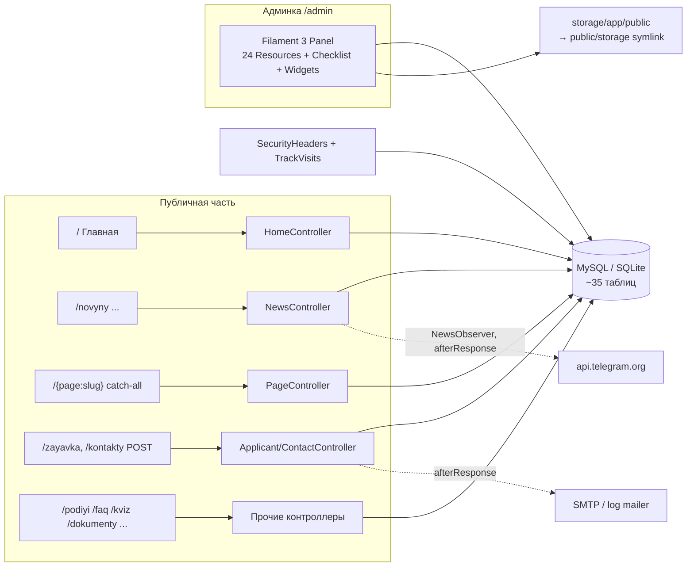

# Архитектура сайта ОТФК (otfk)

> Авторитетный справочник по проекту. Держится в синхронизации с кодом (правила — в [AGENTS.md](AGENTS.md) для Codex и [CLAUDE.md](CLAUDE.md) для Claude). После каждой выполненной задачи любой из агентов обновляет оба файла инструкций.
> HTML-версия: `ARCHITECTURE.html` — build-артефакт, генерируется командой `node DocsHtml/generate.mjs`, руками не редактируется.

## TL;DR

- **Что это:** новый сайт Одесского технического фахового колледжа ОНТУ (замена старого otfk.od.ua), пишется с нуля как **proof-of-concept**. Публичная часть + админка.
- **Стек (подтверждён по коду, НЕ «чистый PHP»):** PHP ^8.2 (CI/прод — 8.3), **Laravel 12**, **Filament 3** (вся админка), Blade + **Tailwind CSS v4** + **Alpine.js 3**, Vite 7. БД: SQLite в dev/тестах, **MySQL в проде**. Composer + npm.
- **Хостинг:** shared-хостинг ukraine.com.ua (SSH, без Node, без queue-воркера) — отсюда ключевые паттерны: фронтенд собирается в CI и заливается на сервер rsync-ом (деплой-workflow), фоновые задачи только через `dispatch(...)->afterResponse()`.
- **Локально:** `php artisan serve --port=8002` (см. `.claude/launch.json`), или `composer run dev` (также запускает queue:listen, pail и Vite; очередь только для dev, на проде воркера нет). Тесты: `composer test` (SQLite `:memory:`).
- **PoC-статус:** ролей нет (любой пользователь = полный админ), сид-данные фейковые, в футере бейдж «Альфа-версія». Полный список — в разделе [PoC-only](#poc-only).

## Структура репозитория

| Директория / файл | Что там |
|---|---|
| `app/Http/Controllers/` | Контроллеры публичной части (админка их не использует) |
| `app/Http/Middleware/` | `SetPublicLocale` (глобально); `SecurityHeaders`, `TrackVisits` (только `web`-группа) |
| `app/Filament/` | Вся админка: Resources (24 шт.), Pages (`ContentChecklist`), Widgets |
| `app/Models/` | 28 Eloquent-моделей + трейты `Concerns/OptimizesUploadedImages`, `Concerns/HasEnglishTranslation` |
| `app/Services/` | `TelegramPoster` — исходящий постинг новостей в Telegram-канал |
| `app/Support/` | `ImageOptimizer` (GD → WebP), `BannerOverlay` (inline-CSS градиенты) |
| `app/Jobs/`, `app/Mail/` | `PostNewsToTelegram`; письма `ApplicantRequestReceived`, `FeedbackReceived` |
| `app/Observers/` | `NewsObserver` — триггер Telegram-автопоста (подключён атрибутом на модели!) |
| `app/Console/Commands/` | `otfk:backup`, `images:webp`, `otfk:import-docs`, `otfk:import-news`, `otfk:mirror-files`, `otfk:storage-export`, `otfk:storage-import` |
| `bootstrap/app.php` | Регистрация роутов, health `/up`, кастомные middleware |
| `config/` | Сток Laravel 12, кроме `blade-icons.php` (отключён дефолтный `<x-icon>`) |
| `database/migrations/` | Схема **и контент-фикстуры** (см. «Миграции как контент») |
| `database/seeders/` | `DatabaseSeeder` (админ), `SiteSeeder` (демо-данные, деструктивен!), `QuizSeeder` |
| `routes/web.php` | Общие SEO-адреса и регистрация `routes/public.php` для `/` и `/en` (API/webhook-роутов нет) |
| `routes/console.php` | Расписание: бэкап БД и prune визитов (еженедельно, UTC) |
| `resources/views/` | Blade: единый layout `components/layouts/app.blade.php` + страницы |
| `resources/css/app.css`, `resources/js/app.js` | Tailwind v4 тема + Alpine; весь кастомный JS — inline в layout |
| `public/build/` | Прод-бандл Vite; **в git не входит** — собирается локально (`npm run build`) и в CI при деплое |
| `tests/Feature/` | Feature-тесты; многие фиксируют поведенческие контракты |
| `docs/posibnyk-administratora.html` | Ручной (не генерируемый) мануал админа для персонала |
| `DocsHtml/generate.mjs` | Генератор HTML-твинов этой документации |
| `.github/workflows/` | `tests.yml` (тесты + сборка фронта) и `deploy.yml` (автодеплой `master` на хостинг) |
| `DEPLOY.md`, `README.md` | Деплой на ukraine.com.ua; обзор фич |
| `AGENTS.md`, `CLAUDE.md` | Синхронные рабочие правила Codex и Claude; каждый агент обновляет оба файла после задачи |

## Карта: страницы → обработчики → хранилище

## Маршруты

Глобально действует `SetPublicLocale`: язык определяется первым сегментом URL (`en` или украинский по умолчанию), включая отдельный middleware-стек Filament. `SecurityHeaders` и `TrackVisits` добавлены только в `web`-группу; Filament задаёт собственный стек в `AdminPanelProvider` и не наследует эти два middleware.

### Публичные (`routes/web.php`)

| Метод | Путь | Имя | Обработчик | Что делает | PoC-only |
|---|---|---|---|---|---|
| GET | `/` | home | `HomeController@index` | Баннеры, тайлы, статистика, события, новости, видео, отзывы, «В этот день» | нет |
| GET | `/novyny` | news.index | `NewsController@index` | Список новостей, пагинация 9, фильтры `?category=`, `?year=` | нет |
| GET | `/novyny/feed.xml` | news.feed | `NewsFeedController` | RSS 30 последних, `max-age=1800` | нет |
| GET | `/novyny/{news:slug}` | news.show | `NewsController@show` | Статья; +1 просмотр раз в сессию | нет |
| POST | `/novyny/{slug}/vpodobayka` | news.like | `NewsController@like` | Лайк-тоггл (JSON), fingerprint = sha1(ip+UA), `throttle:30,1` | нет |
| GET | `/video` | video.index | `VideoController@index` | Видео, пагинация 12 | нет |
| GET | `/rozklad-dzvinkiv` | bells | `BellScheduleController@index` | Расписание звонков + live-индикатор пары | нет |
| GET | `/podiyi` | events | `EventController@index` | Предстоящие + 6 прошедших событий | нет |
| GET | `/podiyi/{event}/ics` | events.ics | `EventController@ics` | Скачивание .ics | нет |
| GET | `/faq` | faq | `FaqController@index` | FAQ + JSON-LD | нет |
| GET | `/kviz` | quiz | `QuizController@index` | Профориентационный квиз, **скоринг целиком в клиентском JS** | **да** (PoC-форма) |
| GET/POST | `/zayavka` | applicants.* | `ApplicantRequestController` | Заявка абитуриента; honeypot `website`, `throttle:5,1`, письмо afterResponse | нет |
| GET | `/dokumenty`, `/dokumenty/{cat:slug}` | documents.* | `DocumentController` | Публичная информация (категории документов) | нет |
| GET | `/spetsialnosti`, `/spetsialnosti/{slug}` | specialties.* | `SpecialtyController` | Специальности + программы | нет |
| GET | `/struktura`, `/struktura/{slug}` | structure.* | `StructureController` | Отделения/комиссии + персонал | нет |
| GET | `/administratsiya` | staff.administration | `StaffController` | Администрация | нет |
| GET | `/halereya`, `/halereya/{slug}` | galleries.* | `GalleryController` | Галереи, лайтбокс, архивный (сепия) режим | нет |
| GET | `/poshuk`, `/poshuk/pidkazky` | search.* | `SearchController` | LIKE-поиск + JSON-подсказки (`throttle:60,1`) | нет |
| GET/POST | `/kontakty` | contacts.* | `ContactController` | Контакты + форма обратной связи (honeypot, письмо). Если опубликована CMS-страница со slug `kontakty`, её локализованный body (текст оригинала с картой) заменяет блок контактов из настроек; сама страница отдельным URL не открывается (`kontakty` в исключениях catch-all) | нет |
| GET | `/sitemap.xml`, `/robots.txt` | sitemap, robots | `SitemapController` / closure | Sitemap (без кэша!), robots | нет |
| GET | `/up` | — | Laravel health | Health-check | нет |
| GET | `/{page:slug}` | pages.show | `PageController@show` | **Catch-all** CMS-страницы из БД. Обязан быть последним | нет |

### Внедрение двуязычности: маршруты, интерфейс, материалы и поиск

- `routes/public.php` содержит общую карту публичных GET/POST-маршрутов с catch-all в конце. `routes/web.php` регистрирует её сначала под `/en` с именами `en.*`, затем без префикса с прежними именами; украинский catch-all остаётся последним. `en` исключён из CMS-слагов; catch-all принимает только один сегмент.
- `/sitemap.xml`, `/robots.txt`, `/up`, админка и файлы остаются общими. `SetPublicLocale` задаёт `en` для `/en/...`, `uk` для остальных запросов, независимо от языка предыдущего запроса.
- `App\Support\LocalizedUrl::route()` строит ссылку по имени маршрута; `to()` меняет язык внутренней публичной ссылки, сохраняя query и fragment; `current()` готовит адрес того же материала для переключателя с параметрами поиска, фильтров и пагинации. Внешние адреса, файлы и служебные пути не префиксуются. Абсолютные ссылки на корень без slash перед query/fragment также локализуются: принадлежность сайту проверяется по scheme/host/port и базовому пути, параметры/якорь сохраняются; внешние origin и URL с userinfo не меняются. Относительные адреса разрешаются относительно текущего URL по правилам браузера (`GuzzleHttp\Psr7\UriResolver`); якоря без пути сохраняются. Файлы, перехваченные catch-all (например `/manual.pdf`), не локализуются.
- `MenuItem::href` подключён к этому механизму; дерево кэшируется общее, адрес вычисляется по текущему языку. Для подсказок поиска под `/en` действует прежнее исключение из статистики. Просмотры, лайки и обработчики форм общие для обеих адресаций.
- Каркас шапки и футера переведён через `lang/uk/layout.php` и `lang/en/layout.php`, включая поиск, accessibility-подписи и JS-индикатор пары. Статические подписи публичных страниц и компонентов — в `lang/uk/public.php` и `lang/en/public.php`: заголовки/описания, формы, кнопки, breadcrumbs, расписание, квиз, пустые состояния и ошибки. Динамические подписи квиза/лайков передаются в Alpine через `@js`; даты/числа вставляются параметрами перевода. Сообщения успеха форм и категории поиска локализованы, служебные письма остаются украинскими. Аварийные 500/503 определяют язык по пути без зависимости от locale middleware или БД. HTML `lang`, Open Graph locale и название сайта соответствуют URL. Английские стандартные бренд/описание без опубликованного перевода берутся из словаря, украинские настройки сохраняются. Публичные текстовые настройки и партнёры поддерживают отдельный опубликованный перевод (подробнее ниже).
- `menu_items.label_en` — необязательный редактируемый в Filament перевод. `MenuItem::localized_label`: украинский оригинал для `uk`; для `en` — непустой `label_en`, затем словарь известных подписей `lang/en/navigation.php`, затем оригинал. Общий кеш дерева не хранит вычисленный перевод; миграция поля сбрасывает `menu.navigation`.
- Переключатель УКР/EN (`components/language-switcher.blade.php`) доступен в шапке на всех размерах экрана; ведёт к тому же материалу и сохраняет query, а JS добавляет текущий fragment при активации. Язык задаётся URL, без cookie или автоматического перенаправления.
- Все публичные Blade-переходы, карточки, хлебные крошки/JSON-LD, квиз, ссылки RSS и ICS, результаты/подсказки поиска используют `LocalizedUrl`; пагинация сохраняет префикс текущего запроса. Обработчики форм контактов/заявки возвращают к локализованному GET-маршруту даже без Referer. Аварийный шаблон 500 выбирает `/en` или `/` по пути запроса без обращения к БД. Sitemap пока общий и украинский.
- `App\Support\LocalizedHtml::links()` локализует href в HTML страниц, новостей, специальностей и отделений при выводе, не изменяя значения в БД. Сохраняет остальную разметку, картинки, комментарии и содержимое script/style/textarea; не является санитайзером.
- `/en` сохраняет `X-Robots-Tag: noindex, follow`: переводы контента машинные и ещё не вычитаны, SEO локализация не завершена.
- Page/News: nullable `title_en`, `excerpt_en`, `body_en`, отдельный `translation_published` (default false), служебный `translation_source_hash` (SHA-256); у Page также `meta_title_en`/`meta_description_en`. Миграция `2026_10_04_130000_add_english_content_to_pages_and_news.php` не меняет исходные материалы и не заполняет переводы. `HasEnglishTranslation::localized()` выбирает поля только при выводе; исходные атрибуты, URL-слаги, счётчики, Telegram и админка остаются общими. Перевод используется на страницах, в родительских/дочерних ссылках, карточках, связанных новостях, архивном блоке главной, RSS и метаданных материала.
- Публикация требует английский заголовок и body, если исходный body непустой; страницы-разделы без body могут иметь только заголовок. Без полного опубликованного перевода материал целиком украинский без уведомлений. Необязательные поля опубликованного перевода остаются пустыми, украинские поля не подмешиваются; Page SEO использует английские title/excerpt при отсутствии английского meta. Изменение оригинала не снимает перевод с публикации.
- Хеш охватывает исходные title/excerpt/body и Page meta-поля. Сохраняется при изменении полного перевода либо включении его публикации; изменение только оригинала, просмотров, лайков или других служебных полей не обновляет хеш. Несовпадение даёт статус «Оригінал змінено» в Filament. Сохранение исправленного перевода подтверждает соответствие текущему оригиналу; выключение публикации сохраняет HTML и хеш.
- В PageResource/NewsResource есть секция «Англійський переклад» и колонка состояния. Английский HTML вводится через Textarea, чтобы ручной перенос не нормализовал таблицы, изображения и разметку RichEditor-ом; локализация href работает при выводе и для английского HTML. Контент остаётся доверенным админским HTML, без санитизации. Общая форма `EnglishTranslation` проверяет полноту при включении публикации либо изменении английских полей (включая SEO); изменение только оригинала/служебных полей разрешено, даже если новое исходное поле временно возвращает материал к цельному украинскому fallback. Флаг публикации и прежний хеш при этом сохраняются; проверки применяются и к вложенным записям Repeater.
- Поиск Page/News и подсказки используют `HasEnglishTranslation::searchPublic()`. На `/en` ищутся title_en/excerpt_en/body_en только полного опубликованного перевода; результат содержит английские title/excerpt и локализованный URL. Если перевода нет, ищется исходный title и показывается украинский материал. Для переведённого материала исходный title не участвует в английском поиске. Украинская версия сохраняет прежний поиск по title. Ограничения `published()` (включая будущие новости), лимиты и минимальная длина запроса 2 символа сохранены; черновики, скрытые и неполные переводы не раскрываются. Устаревший, но опубликованный перевод остаётся доступным. SQL scope `withPublishedEnglishTranslation()` проверяет флаг и заполненность title/body, независимо от хеша.
- RSS переводит заголовок канала и описания для `/en`; опубликованные материалы используют свой язык с общим fallback. Категории новостей используют отдельный опубликованный перевод названия в фильтрах, карточках и деталях; язык категории независим от языка новости.
- Specialty/Department/Program: миграция `2026_10_04_140000_add_english_content_to_academic_entities.php` добавляет nullable `title_en`/`description_en`, `translation_published` и `translation_source_hash`; у Specialty также `short_description_en`, `degree_en`, `study_form_en`, `duration_en`. Оригиналы и файлы не меняются; миграция не заполняет переводы. Общий `HasEnglishTranslation` использует модельные списки исходных и обязательных полей. Для этих трёх сущностей публикация требует title_en и перевода каждого заполненного текстового поля оригинала; без полного опубликованного перевода — весь материал украинский. Новое заполненное поле оригинала без английского эквивалента временно возвращает цельный fallback, сохраняя флаг публикации и прежний хеш. Изменение оригинала отмечает устаревание; обновление полного перевода подтверждает актуальность.
- В Filament трёх ресурсов доступны английские поля и колонка состояния; HTML специальностей/подразделений сохраняется через Textarea, описание программы — обычный текст. Публичный вывод использует `localized()` в списках, деталях, связанных специальностях, программах, метаданных Course, форме поступления и данных результатов квиза. Контроллеры формы/квиза загружают все поля специальностей для проверки полноты перевода; ID, код, slug и ссылки файлов остаются общими. Поиск/подсказки специальностей на `/en` охватывают английские текстовые поля полного опубликованного перевода, иначе исходный title; на украинском — прежний title. Подразделения и программы не добавлялись в поиск.
- FAQ/Event/NewsCategory: миграция `2026_10_04_150000_add_english_content_to_faqs_events_and_news_categories.php` добавляет nullable английские поля и отдельные `translation_published`/`translation_source_hash`, без заполнения контента. У FAQ переводятся question/answer, у Event — title/description/location, у NewsCategory — title. Общий механизм поддерживает модельное главное поле (`question` у FAQ); публикация требует его и перевода всех заполненных исходных текстовых полей. Цельный fallback и актуальность работают как у академических сущностей. В Filament доступны секция перевода и статус; ответы FAQ и описания событий — обычный текст, экранируемый при выводе; JSON-LD FAQ/событий использует JSON_HEX_TAG, сохраняя текст внутри JSON и не позволяя тегам закрыть script. Переводы подключены к FAQ и JSON-LD, событиям на главной, предстоящим/прошедшим событиям и JSON-LD, ICS и Google Calendar, категориям фильтра/карточек/деталей новостей. Даты, ID, slug, URL и флаги видимости общие; UTC-конверсия календарей сохранена. Существующие подсказки событий используют `searchPublic()` по полному опубликованному переводу, иначе исходный title, с прежними ограничениями published/upcoming. FAQ/категории не добавлялись в публичный поиск; события остаются только в подсказках.
- Staff/QuizQuestion/QuizOption: миграция `2026_10_04_160000_add_english_content_to_staff_and_quiz.php` добавляет nullable английские поля и отдельные publication/hash без заполнения контента. Staff переводит full_name/position/academic_degree/bio; публикация требует имени и перевода каждого заполненного текстового поля. Карточки администрации и подразделений используют цельный перевод, включая alt фото и инициалы; контакты, фото и связи общие. Биография хранится как обычный текст и, как прежде, не выводится в карточке. Вопрос квиза переводит question, вариант — label; у каждого собственная публикация и актуальность, варианты редактируются в существующем Repeater Filament. Колонка «Переклад питання EN» показывает состояние самого вопроса; состояние каждого варианта — в его секции. `QuizQuestion::publicPayload()` показывает вопрос и все варианты по-английски только при полном опубликованном переводе вопроса и каждого варианта; иначе весь блок украинский. Новый непереведённый вариант тоже возвращает блок к оригиналу. Контроллер eager-load загружает все поля вариантов; `@js` сохраняет безопасную сериализацию, ID специальностей, порядок и баллы общие. Изменение оригинального текста варианта отмечает устаревание его собственного перевода, изменение баллов не меняет хеш. Staff/квиз не добавлялись в поиск.
- DocumentCategory/Document/Video/Gallery/Photo: миграция `2026_10_04_170000_add_english_content_to_documents_and_media.php` добавляет nullable английские поля и отдельные `translation_published`/`translation_source_hash`, без наполнения. Категория документов переводит title; документ, видео и альбом — title/description; фото — caption. Публикация требует главного поля и перевода каждого заполненного описания. Названия категорий и документы локализуются независимо; поиск/подсказки документов используют `searchPublic()` (английские title/description полного опубликованного перевода, иначе исходный title). Файлы и external_url общие, external_url сохраняет приоритет; перевод карточки не переводит вложение. Видео переводят названия и alt на главной и в каталоге; description хранится, но как прежде не выводится в карточке. YouTube ID, ролик и субтитры общие. Галерея использует `albumLocalized()`/`publicCaption()`: весь альбом, включая карточку, заголовок, описание, alt и лайтбокс, английский только при полном опубликованном переводе альбома и всех непустых исходных caption. Фото без исходной подписи не требует перевода; новый непереведённый caption возвращает весь альбом к украинскому оригиналу. Контроллер списка eager-load загружает фото; `@js` сериализует подпись и URL лайтбокса. Каждый caption имеет собственную публикацию/хеш в Repeater Filament; колонка «Переклад альбому EN» описывает только альбом, состояния фото проверяются отдельно. Изображения, slug, даты, порядок, видимость и архивный стиль общие. Видео/галереи не добавлялись в поиск.
- Banner/QuickLink/Testimonial/StatItem/Setting: миграция `2026_10_04_180000_add_english_content_to_home_blocks_and_settings.php` добавляет nullable английские поля и отдельные публикацию/хеш, без наполнения. Banner переводит title/subtitle/image_alt/link_label; заголовок необязателен как прежде, для публикации нужен хотя бы один непустой английский текст и перевод всех заполненных исходных подписей. Alt использует локализованный image_alt → title → словарь. QuickLink переводит title/description (плитки и партнёры), Testimonial — name/role/quote, StatItem — label; числа value общие. Публичный вывод, alt и инициалы отзывов локализованы; ссылки, даты, изображения, порядок и видимость общие. Эти блоки не добавлялись в поиск. Setting переводит value только у разрешённых ключей `brand_short`, `brand_name`, `footer_about`, `site_description`, `contact_address`, `work_hours`, `announcement_text`, `site_version_label` с type text/textarea. Технические ключи (телефоны/email/URL/цвета/изображения/Telegram) не переводятся. `Setting::map()`/`get()` остаются исходными для служебных вызовов; `publicMap()`/`publicGet()` выбирают язык после чтения общих кешей `settings.map` и `settings.translations` (600с), оба сбрасываются при saved/deleted и новой миграции. У стандартного бренда/описания без публикации сохраняется английский словарь; остальные тексты возвращаются к оригиналу. Пустой исходный текст не включает объявление/бейдж за счёт оставшегося перевода. Хеш настройки включает key/type/value, изменение только group не отмечает устаревание. Filament предлагает текстовое английское значение без лимита 255 символов только для разрешённых настроек; состояние каждого перевода видно в колонке. Абзац `footer_about` в футере выводится только при непустом значении (без словарного fallback в украинской версии). Переводы настроек используются в шапке/футере, контактах, метаданных и RSS, адрес — также в JSON-LD событий. JSON-LD организации экранирует теги через JSON_HEX_TAG; RSS language соответствует локали запроса. Heritage-frame использует текущую публичную локаль даты и английский `Setting::publicGet(brand_name)` с fallback словаря; украинская подпись сохраняет config(app.name).
- Далее по согласованному плану: наполнение и вычитка английских материалов/блоков → применение подготовленных миграций и проверка на хостинге → SEO (hreflang, sitemap, снятие noindex после готовности). Поддержка переводов основных публичных сущностей и редактируемых блоков реализована, включая Banner/QuickLink/Testimonial/StatItem и разрешённые текстовые Setting; наполнение остаётся отдельной работой. Английский поиск Page/News/Specialty/Document и подсказки событий выполнены; расширение поиска на дополнительные сущности и LLM API — отдельные необязательные этапы.
- Проверки: `tests/Feature/LocalizationRoutingTest.php` и `LocalizationShellTest.php`, `LocalizationNavigationTest.php` — маршруты, обе локали, сохранение исходных материалов, переводы меню/кеш, переключатель, публичные переходы, HTML-ссылки, формы, пагинация и RSS. Дополнительно `ContentTranslationTest.php` проверяет публикацию/черновики, цельный fallback, хеш и актуальность, сохранность исходного HTML, карточки/RSS и реальное сохранение через Livewire Filament. Дополнительно `LocalizationSearchTest.php` — английские поля, fallback, черновики/неполные переводы/будущие новости и изоляция языков; `LocalizationPublicUiTest.php` — публичные подписи, формы, ошибки. Квиз, английская выдача и расписание проверены в Browser на отдельной временной SQLite-фикстуре. `AcademicTranslationTest.php` проверяет три новые сущности, цельный fallback/полноту, актуальность, сохранность HTML/файлов, форму/квиз, поиск и сохранение через Filament. `SupportingContentTranslationTest.php` проверяет FAQ/события/категории, JSON-LD, календари, подсказки событий, полноту, хеш, изоляцию языков, видимость и формы Filament. `StaffAndQuizTranslationTest.php` проверяет карточки/alt/инициалы, полноту Staff, цельный fallback квиза, сохранность оригиналов/баллов и вложенные формы Filament. `DocumentsAndMediaTranslationTest.php` проверяет категории/документы, поиск и подсказки, общие файлы/YouTube, видео на главной, цельный fallback альбома, alt/лайтбокс, хеши, видимость и вложенные формы Filament. `HomeBlocksTranslationTest.php` проверяет баннеры (включая отсутствие заголовка), плитки/партнёров, отзывы/инициалы, подписи статистики, разрешённые настройки, целостный fallback, хеши, кеш/изоляцию языков, JSON-LD/RSS и сохранение через Filament. `TranslationReviewRegressionTest.php` проверяет сохранение нового оригинала через Livewire с прежними publication/hash и цельным fallback, строгую проверку публикации/изменений перевода и SEO, английское heritage-оформление, абсолютные ссылки на корень с query/fragment и границы origin. LLM API в коде не подключён. Контент тестовой БД just-test.shop 2026-10-05 переведён разово (подагенты LLM, импорт скриптом через модели без событий и изменения `updated_at`): все Page/News/Staff/Document/Department/Program/Specialty, категории, FAQ, квиз, видео, альбомы, баннеры, плитки, статистика, разрешённые настройки и `menu_items.label_en` имеют опубликованный полный перевод с актуальным хешем; перевод требует вычитки. Английские значения могут не помещаться в VARCHAR 255 (`title_en`, `position_en`) — при импорте проверять длину.

### Админка

Ручных админ-роутов **нет** — всё генерирует Filament (`app/Providers/Filament/AdminPanelProvider.php`): путь `/admin`, login/logout/profile встроенные, **регистрация и сброс пароля отключены**. Auto-discovery ресурсов из `app/Filament/Resources` (ApplicantRequest, Banner, BellPeriod, Department, Document(+Category), Event, Faq, FeedbackMessage, Gallery, MenuItem, News(+Category), Page, Program, QuickLink, QuizQuestion, Setting, Specialty, Staff, StatItem, Testimonial, User, Video), страница `ContentChecklist` («Що ще наповнити»), виджеты дашборда (QuickActions, StatsOverview, VisitsChart, TopNews, TopPages, LatestFeedback).

### API / webhooks

Отсутствуют. `routes/api.php` нет; Telegram — только исходящий. JSON отдают лишь `news.like` и `search.suggest` (обычные web-роуты с CSRF/сессией).

## Авторизация и роли

- Вход: встроенный Filament Login по `/admin/login`. Учётки — таблица `users`, пароль bcrypt (`'password' => 'hashed'`).
- Сессии: драйвер `database` (таблица `sessions`); `AuthenticateSession` в панели.
- **Ролей нет вообще.** `User::canAccessPanel()` возвращает `true` — каждая запись в `users` = полный админ на все ресурсы, включая `UserResource`. Это задокументировано в докблоке как осознанное PoC-решение. Gates/Policies отсутствуют.
- Первый админ создаётся `DatabaseSeeder`: `env('ADMIN_EMAIL', 'admin@otfk.od.ua')` / `env('ADMIN_PASSWORD', 'password')` — **дефолт-фоллбек `password` в публичном репо** (см. PoC-only).

## Схема данных

Прод — MySQL, dev — SQLite-файл (`database/database.sqlite`, в git не входит), тесты — SQLite `:memory:`. Загрузки — диск `public` (`storage/app/public` → симлинк `public/storage`); URL строятся как `asset('storage/...')`.

Доменные таблицы (полный DDL — в `database/migrations/`):

| Таблица | Назначение / ключевые колонки |
|---|---|
| `pages` | CMS-дерево (parent_id, slug unique, body longText, section, is_published, is_heritage, meta_*); английские title/excerpt/body/meta, translation_published/source_hash |
| `news`, `news_categories`, `news_likes` | Новости: category_id, published_at, is_featured, is_heritage, views, likes, telegram_posted_at; английские title/excerpt/body, translation_published/source_hash; категории — title_en, translation_published/source_hash; лайки — unique(news_id, fingerprint) |
| `menu_items` | Дерево навигации: label, label_en (nullable), link_type page/url/route, page_id, is_visible; кэш `menu.navigation` 600с |
| `settings` | Key-value (key unique, group, type — тип виджета в Filament); value_en, translation_published/source_hash для разрешённых публичных текстов; кеши `settings.map`/`settings.translations` 600с |
| `banners` | Слайдер главной: image, image_alt, окно дат starts_at/ends_at; title_en/subtitle_en/image_alt_en/link_label_en, translation_published/source_hash |
| `documents`, `document_categories` | Публичная информация: file_path или external_url (external — приоритет); `title`/`title_en` — TEXT (миграция `2026_10_06_130000`, названия оригинала длиннее 255 символов); Document — title_en/description_en, категория — title_en; отдельные translation_published/source_hash |
| `specialties`, `programs` | Специальности (slug, code 121/123/181/071...) + файлы программ; английские title/description и у Specialty short_description/degree/study_form/duration, translation_published/source_hash |
| `departments`, `staff` | Структура (type: viddilennya/tsyklova-komisiya/kafedra; английские title/description, translation_published/source_hash) и персонал (category: administration/teacher; full_name_en/position_en/academic_degree_en/bio_en, translation_published/source_hash) |
| `galleries`, `photos` | Фотоальбомы: title_en/description_en, фото: caption_en; отдельные translation_published/source_hash; `is_archive` → сепия-режим |
| `videos` | YouTube-ролики (youtube_id → accessors embed/thumb); title_en/description_en, translation_published/source_hash |
| `events` | События; **starts_at хранится как киевское wall-clock время**, UTC — через `utcStart()/utcEnd()`; английские title/description/location, translation_published/source_hash |
| `bell_periods` | Расписание звонков; кэш `bell_periods` 600с |
| `quick_links` | Плитки главной и партнёры футера; title_en/description_en, translation_published/source_hash; URL/иконка/цвет/видимость общие |
| `stat_items`, `testimonials`, `faqs` | Блоки главной: StatItem — label_en (value общие), Testimonial — name_en/role_en/quote_en, FAQ — question_en/answer_en; отдельные translation_published/source_hash |
| `quiz_questions`, `quiz_options` | Квиз: options с points и specialty_id; question_en у вопроса, label_en у варианта, отдельные translation_published/source_hash у обоих |
| `applicant_requests`, `feedback_messages` | Заявки и обращения (name, phone, email, ip, is_processed/is_read) |
| `file_mirrors` | Очередь зеркалирования файлов старого сайта: source_url (+ unique sha256-хеш URL), path на диске `public` (`mirror/{host}/{путь источника}`), status pending/done/failed, attempts, error, size, sha256, mime, fetched_at. Ссылки в контенте — только относительные `FileMirror::publicUrl()` (`/storage/...`), домен в БД не хранится |
| `site_visits` | Аналитика без кук: unique(date, path), без timestamps; спец-путь `_visits` для уникальных визитов; prune > 180 дней |
| users, sessions, cache, jobs... | Стоковые таблицы Laravel |

### Миграции как контент-фикстуры

Ключевой паттерн проекта: реальные тексты старого сайта и структура меню — **версионируемые фикстуры внутри миграций** (`seed_*`, `import_*`), чтобы попадать на прод через `migrate --force` без `db:seed`. Почти все идемпотентны (`firstOrCreate`), `down()` намеренно не удаляет контент. Последствия и ловушки — в [Gotchas](#gotchas).

Восстановление схемы после старого удаления таблиц: `2026_10_04_175000_restore_missing_content_tables` создаёт только отсутствующие `testimonials`, `applicant_requests`, `feedback_messages` по исходной схеме, без наполнения или изменения существующих записей; `down()` сохраняет таблицы. Имя ставит восстановление перед миграцией перевода `180000`, даже если предыдущие миграции уже выполнены. `180000` добавляет только отсутствующие столбцы, сохраняя переводы при повторе после частичного MySQL DDL. На старом хостинге в журнале может оставаться `2026_08_28_180000_drop_applicant_feedback_testimonials`, отсутствующая в текущем checkout: записи журнала не гарантируют наличие таблиц. Возврат удалённых тогда данных этой миграцией не выполняется.

### Сидеры

- `DatabaseSeeder` — админ (env или дефолт) → `SiteSeeder` → `QuizSeeder`.
- `SiteSeeder` — **демо-данные и деструктивен при повторном запуске**: делает `delete()` по `menu_items`, `staff`, `videos`, `banners` и документам/программам сидируемых категорий. Никогда не запускать `db:seed` на живом проде с реальным контентом.
- `QuizSeeder` — 6 вопросов × 4 варианта, привязка к специальностям по `code`; идемпотентен; также вызывается изнутри миграции `2026_06_12_100000_create_quiz_tables`.

## Фоновая работа без очереди

На хостинге нет queue-воркера, поэтому **всё «фоновое» — `dispatch(...)->afterResponse()`** (выполняется в умирающем PHP-запросе): Telegram-пост, письма форм, WebP-конверсия загрузок. **Не переводить на `ShouldQueue`** — задокументированный запрет (DEPLOY.md).

Telegram-автопост: `NewsObserver` (подключён PHP-атрибутом `#[ObservedBy]` на модели `News`, НЕ в провайдере) атомарно ставит `telegram_posted_at` (`whereNull->update`) и диспатчит `PostNewsToTelegram`. Включается тремя настройками из БД: `telegram_autopost === '1'`, `telegram_bot_token`, `telegram_channel`.

### Зеркалирование файлов и перенос хранилища

Загрузка файлов на хостинг без SSH: в `file_mirrors` ставится URL (`FileMirror::enqueue()` или прямой INSERT с `source_hash = sha256(source_url)`, `status = pending`), а `otfk:mirror-files` из планировщика (каждую минуту, `--limit=30`, `withoutOverlapping`) скачивает файл сервером в `storage/app/public/mirror/{host}/{путь}`. Разрешены только хосты `services.file_mirror.hosts` (env `FILE_MIRROR_HOSTS`, по умолчанию otfk.od.ua), белый список расширений (документы, архивы, растровые изображения, медиа; SVG/HTML запрещены), лимит `FILE_MIRROR_MAX_MB` (100). Содержимое проверяется по сигнатуре: HTML-страница 404 со статусом 200 не сохранится. 3 неудачные попытки → `failed`; `--retry-failed` возвращает в очередь. Требует cron `schedule:run` и исходящий HTTPS с хостинга. Без cron очередь обрабатывается вручную workflow `.github/workflows/mirror-files.yml` (`workflow_dispatch`, входы limit/verify/retry_failed; по SSH с секретами деплоя выполняет `otfk:mirror-files`): `gh workflow run mirror-files.yml -f limit=500`. На just-test.shop 2026-10-06 cron не срабатывал (задание не обработано за 7+ минут после деплоя); через workflow зеркалировано 863 файла otfk.od.ua (6 ссылок битые и на оригинале), ссылки в контенте тестовой БД переписаны на относительные `/storage/mirror/...`.

Переезд на другой хостинг: (1) БД — `otfk:backup` → импорт дампа; (2) файлы — `otfk:storage-export` на старом сервере создаёт `storage/app/backups/storage_*.zip` со всем диском `public` и манифестом `.otfk-storage-manifest.json` (path/size/sha256), `otfk:storage-import <zip>` на новом восстанавливает с проверкой sha256, не удаляя и (без `--overwrite`) не заменяя файлы; (3) `otfk:mirror-files --verify` повторно скачивает зеркальные файлы, отсутствующие или с другим хешем; с `--from=https://старый-хост` они берутся из `/storage/{path}` старого хостинга и принимаются только при совпадении записанного sha256 (если оригинал уже недоступен). Пошагово — DEPLOY.md.

## CI / деплой

### `.github/workflows/tests.yml` — CI («Тести»)

Триггер: каждый `push` и `pull_request` (без фильтров). Секретов не использует.

- **Job `tests`** (ubuntu, PHP 8.3): checkout → setup-php (pdo_sqlite, gd, intl...) → composer-кэш → `composer install` → `composer audit` (advisory, `continue-on-error`) → `cp .env.example .env` + `key:generate` → `php artisan test`. Заметь: тесты на SQLite, прод на MySQL — MySQL-специфика CI не ловится.
- **Job `assets`** (ubuntu, Node 20): `npm ci` → `npm run build` — smoke-проверка, что фронтенд собирается.

### `.github/workflows/deploy.yml` — CD («Deploy to production»)

Триггер: push в `master` или ручной `workflow_dispatch`; `concurrency: deploy-production` (без отмены запущенного). Шаги: сборка фронта в CI (Node 22, `npm ci && npm run build`) → SSH на хостинг (`git fetch` + `git reset --hard origin/master`, `composer install --no-dev`) → rsync `public/build/` на сервер (`--delete`) → `migrate --force` + `optimize:clear` + `config:cache`/`route:cache`/`view:cache`. Репозиторий публичный, поэтому сервер тянет код по https без deploy key. Секреты: `REMOTE_KEY` (приватный SSH-ключ), `REMOTE_HOST`, `REMOTE_USER`, `REMOTE_PATH`, опционально `REMOTE_PORT` (дефолт 22). Деплой feature-веток не настроен — окружение одно.

### Фронтенд-бандл

`public/build/` **не коммитится** (в `.gitignore`): его собирает деплой-workflow и заливает rsync-ом. Локально — `npm run build`/`npm run dev`. (Ранее бандл коммитился в git, а `scripts/frontend-source-hash.mjs` следил за его свежестью — механизм удалён вместе с переходом на CD.)

### Первичный деплой (DEPLOY.md, хостинг ukraine.com.ua «Кращий»)

Вариант A: `git clone` → `composer install --no-dev` → `.env` из `.env.production.example` → `migrate --seed --force` (**обязательно до** `artisan optimize` — кэш конфига ломает env-чтение в сидере) → `filament:assets` → `storage:link` → `optimize` → document root на `public/`; `public/build` при первом деплое залить вручную. Вариант B: zip с локально собранными `vendor/` и `public/build/`. Cron: `* * * * * php artisan schedule:run` (расписание: `otfk:backup` вс 03:30 UTC, prune `site_visits` вс 04:00 UTC, `otfk:mirror-files --limit=30` каждую минуту).

## Gotchas

1. **Таймзона.** `config/app.php` хардкодит `'timezone' => 'UTC'` и НЕ читает `APP_TIMEZONE` (переменная в `.env.production.example` — мёртвая). Даты хранятся как киевское wall-clock и «дошифтовываются» вручную `shiftTimezone('Europe/Kyiv')` в 5 местах (`Event::utcStart/utcEnd`, `news/show`, `feed/news`, `events/index`). Расписание cron — в UTC (03:30 UTC = 06:30 Киев летом).
2. **Catch-all `/{page:slug}`** в конце `routes/public.php` (последняя регистрация в `routes/web.php`) с хардкод-регекспом исключений (`admin|livewire|novyny|...`). Любой новый top-level роут надо добавить в этот регексп, иначе его перехватит `PageController`.
3. **`NewsObserver` подключён атрибутом на модели** — `AppServiceProvider` пуст; Telegram-сайд-эффект легко не заметить при правках `News`.
4. **`telegram_posted_at` ставится ДО успеха HTTP-вызова**: при сбое Telegram новость навсегда помечена отправленной, только `Log::warning`. Ретрай — вручную обнулить поле.
5. **Fresh-install ловушка:** контент-миграции `seed_abituriyentu_sections` / `seed_studentu_sections` / `import_*` тихо no-op, если страницы/меню ещё не созданы `SiteSeeder`-ом, и повторно не выполняются (уже отмечены как прогнанные). Правильный порядок нового окружения: `migrate` → `db:seed` даёт полный результат только потому, что сидер строит дерево сам; вникай перед изменением этого порядка.
6. **`SiteSeeder` деструктивен** (delete меню/персонала/видео/баннеров) — только для пустых окружений.
7. **Миграции используют Eloquent-модели** (`Page`, `MenuItem`, `DocumentCategory`, вызов `QuizSeeder`) — переименование модели/фила ломает `migrate` с нуля. Меню-миграции ищут корни по украинским label-строкам («Абітурієнту» и т.п.) — переименование пункта меню в админке ломает их идемпотентность.
8. **Dynamic Tailwind-классы из БД:** `home.blade.php` строит `bg-{{ $tile->color }}-50`; работает только благодаря safelist `@source inline(...)` в `app.css` (brand/gold). Другой цвет тайла молча отрендерится без стилей.
9. **Хардкод-слаги в шаблонах:** `url('/abituriyentu')` в 7 местах указывает на CMS-страницу из БД (удаление/переименование = 404 главного CTA); drop cap завязан на slug `istoriya` (`pages/show.blade.php`), закреплено тестом `HeritageProseTest`.
10. **Светлая тема — контракт.** Ночной режим удалён намеренно; `FrontendPolishTest::test_site_is_light_only_without_theme_toggle` следит, чтобы toggle/`localStorage theme` не вернулись. Настройка `night_opacity` удалена миграцией; остался только `banner_overlay_opacity` (затемнение баннеров, `App\Support\BannerOverlay`).
11. **«Лампа» / Tier / Polish** в именах миграций и тестов — внутренние кодовые имена этапов сдачи, не фичи. `LampaTwo` = флаги `is_heritage`/`is_archive`.
12. **Layout ходит в БД:** `app.blade.php` дергает `MenuItem::navigation()`, `Setting::publicMap()`, `QuickLink`, `BellPeriod::active()` на каждой странице (частично кэшировано на 600с). Миграции и прямые SQL-правки `settings` обязаны сбрасывать `settings.map` и `settings.translations`; локаль не включается в общий кеш.
13. **Неэкранированный HTML:** `{!! $news->body !!}`, `{!! $page->body !!}`, `map_embed` → iframe. Контент админский, но санитизации нет.
14. **Sitemap без кэша** — 5 полных `->get()` по таблицам на каждый запрос; деградирует с ростом архива новостей (импортирован с 2014).
15. **Импорт-команды `otfk:import-news|docs` ходят на живой legacy-сайт** otfk.od.ua; `--fresh` удаляет ранее импортированное. Не запускать бездумно. `otfk:mirror-files` тоже ходит на legacy-сайт, но только по очереди `file_mirrors` и ничего не удаляет.
16. **`FILESYSTEM_DISK=local`** в env, но все загрузки/URL рассчитаны на диск `public` (Filament по умолчанию грузит в `public`). Код, использующий default-диск, запишет в недоступное место.
17. **Тесты ловят контракты** — перед правкой поведения читай соответствующий Feature-тест (excerpt-дедупликация, heritage-типографика, чеклист контента, light-only и т.д.).
18. **`SecurityHeaders` намеренно без CSP** (инлайн-скрипты Livewire/Alpine/Filament); `SESSION_SECURE_COOKIE` в прод-шаблоне не задан.
19. **DEPLOY.md** — смесь русского и украинского языка; описывает первичный ручной деплой, обновления едут автодеплоем (`deploy.yml`).
20. **`docs/posibnyk-administratora.html`** — ручной, без генератора, шрифты с внешнего CDN; дрейфует от админки при изменении фич.

## PoC-only (удалить/заменить перед продом)

Консолидированный список. Новые временные элементы добавлять сюда же (правило в [CLAUDE.md](CLAUDE.md)).

| # | Что | Где | Действие перед продом |
|---|---|---|---|
| 1 | Дефолт-креды админа `admin@otfk.od.ua` / `password` | `database/seeders/DatabaseSeeder.php` | Убрать фоллбек; требовать env. DEPLOY.md даже предлагает логиниться этими кредами — поправить |
| 2 | Нет ролей: каждый user — полный админ | `app/Models/User.php` `canAccessPanel()` | Ввести роли/политики или хотя бы ограничить `UserResource` |
| 3 | Бейдж «Альфа-версія» в футере | настройки `site_version_label/color` (сид в `2026_06_10_150000`) | Очистить label (пустой = скрыт) |
| 4 | Ссылка «Адмінпанель» в публичной шапке | `components/layouts/app.blade.php` (utility bar) | Убрать |
| 5 | Фейковый персонал (8 выдуманных людей), фейковые документы «документ №N», демо-программы, демо-новости, демо-баннеры «Вступ 2026» | `database/seeders/SiteSeeder.php` | Заменить реальным контентом; сидер на прод не гонять повторно |
| 6 | Чужие YouTube-ролики (M7lc1UVf-VE и др.) | `SiteSeeder` | Заменить видео колледжа |
| 7 | Плейсхолдер-контакты `+38 (048) 000-00-00`, `info@otfk.od.ua`, generic-карта Одессы | настройки из `SiteSeeder` | Реальные контакты в админке |
| 8 | Хардкод-статистика «1000+ / 90+ / 6 / 80+» | сид в `2026_06_11_090000_create_stats_and_events.php` | Проверить/актуализировать в админке |
| 9 | 3 канированных FAQ «о самом сайте», дефолтные времена звонков | сиды `2026_06_11_170000`, `2026_06_10_180000` | Проверить/заменить |
| 10 | Квиз `/kviz`: клиентский скоринг, вопросы из `QuizSeeder` | `resources/views/quiz/index.blade.php` | Решить судьбу фичи; контент — методистам |
| 11 | Импортированные тексты старого сайта (не вычитаны) | миграции `import_*_content` | Редакторская вычитка |
| 12 | Импорт-команды со скрейпингом legacy-сайта | `app/Console/Commands/ImportOtfk*` | Удалить после финального импорта |
| 17 | Ежеминутная задача зеркалирования файлов legacy-сайта и каталог `storage/app/public/mirror/` | `otfk:mirror-files`, `routes/console.php`, `file_mirrors` | После финального переноса файлов можно убрать из расписания; таблицу и файлы сохранить (на них ссылается контент) |
| 13 | Telegram-токен плейнтекстом в `settings` + открытое поле в админке | `SettingResource` | Маскировать поле / перенести в env |
| 15 | `/en` имеет переведённый интерфейс, переводы Page/News/Specialty/Department/Program/FAQ/Event/NewsCategory/Staff/QuizQuestion/QuizOption/DocumentCategory/Document/Video/Gallery/Photo/Banner/QuickLink/Testimonial/StatItem и текстовых Setting, поиск Page/News/Specialty/Document, на тестовой БД just-test.shop материалы переведены 2026-10-05, нужна вычитка; `noindex` | `SetPublicLocale`, `routes/public.php` | Вычитать переводы тестовой БД, отдельно проверить наполнение целевого прод-окружения и SEO; затем решить снятие `noindex` |
| 16 | Самостоятельный альбом редизайна: демонстрационные показатели, тексты и действия; не подключён к приложению | `docs/redesign-2026-10-05/` | Использовать для согласования; переносить в Blade/Filament отдельной задачей, не публиковать как готовый сайт |
| 14 | Мёртвый груз: axios в бандле (не используется, всё на fetch), `laravel/sail` без compose.yaml, pest-plugin в allow-plugins | `resources/js/bootstrap.js`, `composer.json` | Удалить |
